# Old Events 

## October 7 (Saturday) from 12:30pm 

### Featuring F. Sigmund Topor and Diane Nagatomo!
__Location:__ Kannai Hall Youth Center (〒231-0013 Kanagawa, Yokohama, Naka Ward, Sumiyoshicho, 4 Chome−42-1, Floor B2)  (To join us via Zoom, send an email to yojaltpresident@yojalt.org)

 

__Start time:__ 12:30 pm (doors open from 12:15). A social get-together in the Kannai area will follow this event.

__Presenter 1:__  F. Sigmund Topor

__Title:__  Academic Writing for Japanese Academicians

 

__Abstract:__  Academic Writing is a process that encapsulates cultural and theoretical presuppositions. The communicative culture in the Japanese environment reflects the curriculum that is being used in the education system in Japan. Integrated with Confucianism, Japan’s sociolinguistics is not totally the same as Western practice that employs logic or syllogism in academic writing. In the Japanese context, responsibility of understanding a written text is imposed on the reader whereas in English, the writer has responsibility to ensure that a text is devoid of miscomprehension. The cultural context of communication in Japanese is predicated on normative Confucian communication conventions that  entails staunchly entrenched pragmatics involving the notion of face, indirectness, gender, age, and social status.  Attempts to teach academic writing in the Japanese context without understanding the effects of culture will certainly relegate such writing exercises as pure academic.

 

__Bio:__ “F” stands for Francis (oftentimes mispronounced as Frances). F. Sigmund Topor is a Scholar-Practitioner and President of International & Intercultural Communications. Dr. Topor has taught Academic Writing at Temple University Japan campus, the University of Electro-Communications, and Keio University, Japan. He is Author and Editor of several books and book chapters, including: <em>Cultural Perspectives on Global Research Epistemology: Emerging Research and Opportunities; Examining Ethics and Intercultural Interactions in International Relations; Ethical Standards and Practice in International Relations; The Need for Global Standards in Biomedical Ethics and the Qualitative Methodology; The Empowerment of Japanese Women; A Sentence Repetition Placement Test For EFL/ESL Learners In Japan</em>, and more.

 

__Presenter 2:__  Diane Nagatomo

 
__Title:__  Writing for Academic Publication

__Abstract:__  In this presentation, “Developing a Strong Academic Voice”, Diane Hawley Nagatomo will give some practical tips on how to improve academic writing for both graduate school work and for academic publication. Topics to be covered will be paying attention to word order, avoiding long sentences, and being concise. Participants will be invited to share the difficulties they might have in academic writing.

 

__Bio:__ Diane Hawley Nagatomo has been teaching and living in Japan since 1979. She is a retired professor from Ochanomizu University and the author of more than 20 EFL textbooks, numerous academic articles, and two academic monographs _Exploring Japanese University English Teachers Professional Identity_ and _Identity, Gender and Teaching English in Japan_ . She is also one of the series editors for Candlin and Mynard’s “Life and Education in Japan” series. Her debut novel _The Butterfly Café_ was published in July. 

 

After the speakers, we will have a group conversation about the use of generative AI in the language-learning classroom, then head out for some socializing!

 

*****************************************************************
## July 2023: YoJALT was proud to be a co-sponsor for the JALT Listening SIG Conference (July 15, 2023 in Tokyo) .

 

## June 25th, 2023: My Share (Hybrid)!

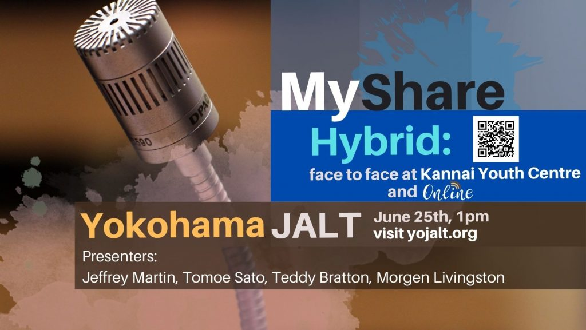

## June 2023: YOJALT My Share  

 

If you decide to join us __in person__ , we'll be at Kannai Hall: 〒231-0013 Kanagawa, Yokohama, Naka Ward, Sumiyoshicho, 4 Chome−４２−1, Kannai Hall Youth Center (Our room is on B2). We plan to go out for a drink after the event.

 

__List of presenters__ 

 

## 1) Jeffrey Martin  - Students transcribing and studying their conversations for guided practice ]
Email: <a href="mailto:jeffmjp@gmail.com" target="_blank" rel="noreferrer noopener">jeffmjp@gmail.com</a>
 
__Abstract:__  There is opportunity in having L2 learners analyze transcriptions of their interactions. I would like to share the takeaways from research of mine about how a JSL learner benefited from the study of his own transcribed conversations. I would then like to share a classroom project done with EFL learners that was inspired by this research. The students followed a guided process of recording, transcribing, and analyzing their L2 conversations. Each student drew unique insights. 

 

__Bio:__ Jeffrey Martin has taught EFL learners in a variety of settings within secondary and tertiary education in Japan. He is pursuing a Ph.D. at Temple University, Japan Campus. Some of his research interests include materials design, vocabulary development, L2 listening, and pragmatics. 

 

### 2) Tomoe Sato - Quizizz Lesson

Email: sato.tom.bb@yokohama-cu.ac.jp

 

__Abstract:__  Have you had an experience where you lost your students’ focus and attention but continued with your class? In order to bring liveliness in class, I have been using online educational games and recently started using Quizizz Lesson. It is not merely engaging, but students seem to pay more attention because they want to rank higher in the leaderboard. They could participate anonymously, and there are plenty of free features for us to create lessons.

 

__Bio:__ Tomoe is an English instructor at Yokohama City University. She has taught ESL and Japanese at colleges and universities in the US before returning to Japan. Her research interests include motivations, gamifications, and Mobile Assisted Language Learning.

 

### 3) Teddy Bratton - Cliffhanger Script Presentations

Email: <a target="_blank" rel="noreferrer noopener" href="mailto:teddybratton@live.com">teddybratton@live.com</a>

 

__Abstract:__  The cliffhanger script presentation is a multifaceted and highly customizable activity that allows students to practice a wide range of language skills. By using of video clips from popular TV shows and movies, students are not only exposed to and encouraged to use authentic English, but are also motivated to pursue opportunities to engage with the language outside of the classroom. Due to the difficulty involved in creating original materials for this activity, I will be giving some tips based on my own experience.

 

__Bio:__ Theodore A. "Teddy" Bratton has a decade of experience teaching English in Japan. He currently works at Ferris University in Yokohama. His research interests include task-based language teaching and student motivation.

 

### 4) Morgen Livingston - Otter.ai

Email: <a target="_blank" rel="noreferrer noopener" href="mailto:mliving.learning@gmail.com">mliving.learning@gmail.com</a>

 

__Abstract:__  In this presentation, I will share my experiences of Otter.ai, a speech transcription technology, and an associated speaking activity I designed to boost students’ speaking confidence, improve self-correction ability, and enable self-directed learning. Based on my experiences using this activity both online and in person, I will demonstrate how to use Otter.ai, discuss challenges I faced, and give general tips on how it can be used to improve students’ speaking ability.  

 

__Bio:__ I have been teaching EFL in Japan for around 7 years. Most recently, I taught university students at Toin University and am currently teaching soft CLIL lessons to junior and senior high schoolers at Salesio Gakuin. I'm interested in the affective areas of language acquisition and am always trying to find ways to incorporate critical thinking and real world skills into my lessons. 

 

If there is time for more presenters we will accommodate more short presentations about practical teaching ideas and/or teacher tips!

 

## May 28, 2023 (Sunday): Allyship and activism in the language-learning classroom 

 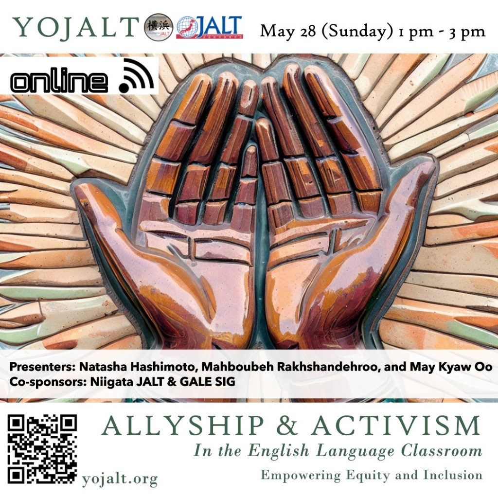

### Session 1 

__Presenters:__  Natasha Hashimoto & Mahboubeh Rakhshandehroo

__Bios:__  Natasha Hashimoto is an associate professor at Tokyo Woman’s Christian University. Her Ph.D. is in education/applied linguistics, and her master’s is in human rights. Her teaching and research interests include human rights issues in TESOL, Bourdieusian theoretical framework, multilingualism, metacognitive strategies, social-emotional learning, and fairness in language testing. She co-edited  Teacher narratives from the Eikaiwa classroom: Moving beyond “McEnglish” with Daniel Hooper in 2020.

Mahboubeh Rakhshandehroo is an associate lecturer of English at Kwansei Gakuin University. Additionally, she serves as the leadership team coordinator of the East Asia regional group of Integrating Content and Language in Higher Education (ICLHE). She received her PhD in Human Sciences (Critical Studies in Transformative Education) from Osaka University. Her research interests include English-Medium Instruction (EMI) support, native speakerism, and multiculturalism.

__Title:__ On Teaching (in) English as Foreign, Female, and "Nonnative" 

__Abstract:__ 

This presentation is based on a duoethnographic study carried out from December 2021 to December 2022. The aim was to discuss the reconceptualization of English education in Japan through the transformation of language ideologies from the bottom up (Kubota, 2020). An important point of the discussion we engaged in was native-speakerism. Native-speakerism is an ideology that negatively impacts language learners’ confidence in using the target language and positions them outside the realm of English language speakers, since the ultimate goal is, for many, to speak like a “native speaker,” a goal they cannot reach since they had not been born in an English-speaking country (Matsuda, 2003; Shiroza, 2020). We argue that teacher autoethnography and sharing pedagogical practices with other teachers could potentially create spaces for engaging our students and reevaluating native-speakerist ideologies. 

 

We are two foreign, multilingual, working women, married, with children. We both teach (in) English at Japanese universities. Our data collection started with a 90-minute video interview, which was followed by additional interviews and regularly sharing our thoughts via a Google document where we collaborated to create our narrative. We wrote about what was happening at work in regard to our “NNES” status and our interactions with students, which has resulted in close to 10,000 words of diary exchanges. Our study shows that despite our marginalized positions in Japanese ELT, we can create spaces for our professional development, meaningful student engagement, and students' personal growth. This study also serves as further evidence of the usefulness of duoethnography as a research method and tool for professional development.

 

__Session 2__

__Presenter:__  May Kyaw Oo

 

__Session Title:__  Empowering Ourselves and Others: Strategies for Becoming Active Allies in ELT

In the English language teaching (ELT) industry, marginalized identities such as people of color and those who do not come from native English-speaking countries are often targets of implicit biases, microaggressions, and discrimination (Holliday, 2019; McKinney & Norton, 2008). Despite these issues being prevalent, colleagues may fail to recognize these biases and microaggressions or may not know how to effectively respond to support their marginalized colleagues (Elliott, 2017; Yan & Bao, 2019). The objective of this workshop is to raise awareness of the impact of implicit biases and discrimination in the ELT workplace and provide strategies for becoming active allies. The workshop will begin with exploring and defining the meaning of microaggressions followed by a brief sharing session where participants can share their experiences if they so wish to. It is my hope that participants will learn about the importance of acknowledging privilege and marginalization in the workplace and discuss practical steps for creating a more inclusive environment for all colleagues and students (Kumaravadivelu, 2012; Seloni & Chun, 2017). By doing so, participants can empower themselves and their colleagues, and help promote equity and justice in ELT.

 

__References:__  Elliott, N. (2017). Microaggressions in the ELT workplace: A personal account. ELT Journal, 71(1), 77-86.Holliday, A. (2019). Identity and language learning: Extending the conversation. Multilingual Matters. Kumaravadivelu, B. (2012). Language teacher education for a global society: A modular model for knowing, analyzing, recognizing, doing, and seeing. Routledge.McKinney, C., & Norton, B. (2008). Identity in language learning and teaching: Research agendas for the future. TESOL Quarterly, 42(3), 537-543.Seloni, L., & Chun, C. W. (2017). Language teaching as a site for transformative dialogue and praxis. Applied Linguistics Review, 8(3), 275-299.Yan, X., & Bao, D. (2019). Native speakerism in English language teaching: An overview. English Language Teaching, 12(11), 17-28.

__Speaker Bio__ : May Kyaw Oo is originally from Myanmar. She is currently serving as an assistant professor at Nagasaki University. May has earned two Master's degrees, including an M.A. in English literature from Assumption University in Thailand and an M.A. in TESOL from the University of Exeter, UK. She is interested and passionate about equity, inclusion, and social justice issues within the TESOL field and the wider context. May is an active member of the Japan Association for Language Teaching (JALT), serving as publicity chair for Global Issues in Language Education SIG and as the Deputy Chair of Diversity, Equity, and Inclusion (DEI) Committee.

  

## Redefining ADHD in Language Education

Sunday, April 9, 2023 

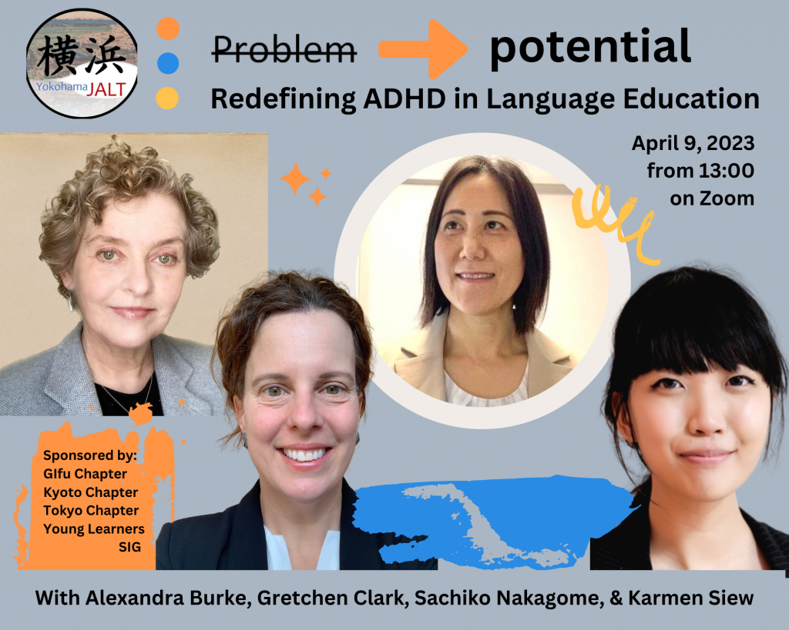

This event is sponsored by Gifu JALT, Kyoto JALT, Tokyo JALT, TYL SIG and YoJALT!

 

Register by email: <a href="mailto:yojaltpresident@yojalt.org">yojaltpresident@yojalt.org</a>

 

In this four-part presentation, the speakers  discussed Attention-Deficit Hyperactivity Disorder (ADHD) and how it may affect learners from four different perspectives.

__Karmen Siew__  begins with a general introduction about what ADHD is and how it affects the brain’s executive function. She will discuss a variety of coping mechanisms and affirm the necessity of being easy on yourself and finding a tribe of people who understand the issues you might be facing.

__Alexandra Burke__  will discuss how ADHD might affect students in the school setting. In particular, how classroom management styles can either boost or wreak havoc on a young person’s ability to cope at school.

__Gretchen Clark__  will focus on the inattentive version, ADD, a largely ‘invisible’ form of ADHD and offer insight into how students afflicted with it may approach study. Because women tend to present as ADD more so than as ADHD, her presentation will largely concern this demographic.

__Sachiko Nakagome__  will speak about her reasons for seeking a diagnosis, her emotional post-diagnosis journey, the various reactions from Japanese and English-speaking peers about her diagnosis, and effects of a state-of-the-art treatment she received.

In combination, the presenters endeavor to promote awareness of ADHD and how language study may be in some ways more difficult but in other ways, an adventure or even a ‘safe’ subject for the neurodiverse (ND) student. Language classes – where students are encouraged to express their opinions, be themselves, and are rewarded for speaking up – can be the perfect place for students to explore, preserve and respect each other’s individuality. The presenters encourage attendees to listen, take notes and help create such “safe” environments in their own classrooms to give more ND students opportunities to accept and love themselves to develop confidence and find academic success.

 

### Profiles 

__Alexandra Burke__ has taught at all levels of the Japanese public education system and currently teaches part-time at four universities in the Tokai Region. She is a 3 time winner of the “Michele Steele Best of JALT Chapter Award” for presentations on neurodiversity awareness.

__Gretchen Clark__ has taught EFL in the Kansai area for over 20 years, but only recently became aware of how neurodiversity factors into a young person’s learning experience. Like her co-presenters, she aspires to make the classroom a joyful place for language study for all students.

__Karmen Siew__  is a JHS/SHS teacher in Tokyo with a background in psychology. She is 2e (gifted/ADHD) and sees herself in many ‘problem students’, who are usually ND. She hopes to help both staff and ND students have more positive experiences in school.

__Sachiko Nakagome__ has been teaching for 20 years. She also works as a writer, translator, and narrator.

 

 

## March 19, 2023

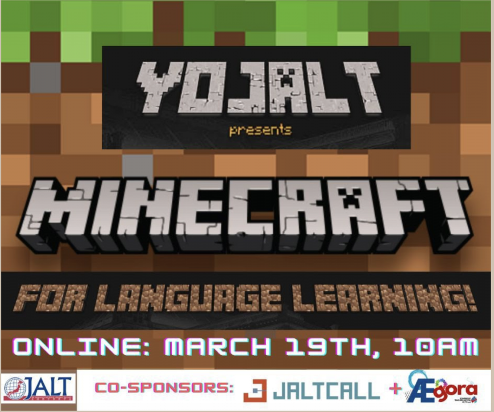

__Promoting active language learning through Minecraft__

As language is a tool for doing things; in Minecraft, we are naturally nudged to communicate with others. However, although authentic tasks promote the need to communicate, it does not mean that it will occur in the target language without crafting the right conditions for language learners to use it. Therefore, when implementing Minecraft in our classrooms, we need to take into consideration the tasks, their language level and the amount of linguistic scaffold needed to support language learners in their projects inside Minecraft. In this workshop, we will provide teachers with the opportunity to experience Minecraft through hands-on activities inside the game, reflect on this experience by connecting them to the classroom, as well as discuss examples of how Minecraft can be used. This session will combine asynchronous (pre and post session tasks) with a 90-minute synchronous session. Participants will be able to choose between two modes of participation: Full mode which combines practical experience in-game with the reflective tasks) and Reflective mode only. In the latter mode, participants will be able to access all the pre and post tasks, choose the ones they want to do, observe the hands-on experience in-game during the live session and reflect along with all other participants.

Speakers: Rose Bard and Kathryn Kashitsyn (see more at https://minecraft4elt.com/)

 

 

*************************************************************************
 

## __January 22, 2023__ 

YoJALT online program: Emerging Voices

 

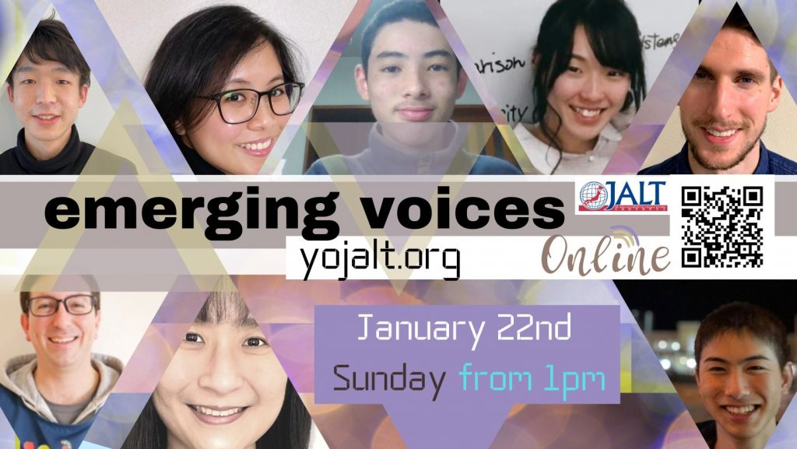

Program line up:

 

__Takumi Nakao__ 

 

__Title:__  Why an ordinary high school student in Yokohama transferred to an online high school and lives on Kikaijima Island__ 

 

__Abstract:__   I was an ordinary high school student who went to a public high school in Yokohama. However, ever since my high school life started, I had thought that the education my school provided me was not what I hoped to have on many points. It was because I was aiming to go to college abroad and grow as a person in the global environment. Therefore, I have always been trying out how I can learn English (and many other things) more effectively and grow myself by utilizing different opportunities and resources online without relying on school education. Through those experiences, not only could I improve my English skills but gained lots of insight, network, and confidence, which helped me make a big decision. 

   At the end of last summer, I finally decided to relinquish my useless school education and design my education on my own by taking a gap year. I moved to an online high school in October and left my family and hometown in November. Since then, I have enjoyed living on an island with local people where I can learn a lot by immersing in their traditional lifestyle, beautiful nature, and challenging social issues. At the same time, I can spend plenty of time communicating with different mentors online and having a self-dialogue to plan my future.

 

__Bio:__ Takumi Nakao (he/him) | Senior in N high school | Raised in Yokohama | Lives in Kikai island | Taking a gap year

 

__Natsuho Mizoguchi__ 

 

__Title:__  My Journey as a Young Japanese in JALT__ 

Summary: Since the early days as a member and an officer in JALT, the presenter has acquired various knowledge and perspectives that she would have otherwise never had outside the association. Those experiences include warm and happy moments shared with friends and teammates, as well as tough times that she was not very sure what she could do to be of contribution to the group. However, being a part of JALT became an important step of her professional path as a language teacher in Japan. This talk will explain the struggles the presenter had and how they are now helping her to serve as the Chair of SPINS. Bio:Natsuho Mizoguchi is a part-time lecturer at Gifu University. She has been the Chair of JALT Student Peer Interaction Network Subcommittee (SPINS) since its creation in 2021. She also fulfills her role as an officer of Gifu chapter and a conference organizing committee member of JALT2023, PanSIG2023, and JALTCALL2023.

 

__Emily Choong__ 

 

__Title:__  “Why am I so nervous?”: Developing a speaking anxiety questionnaire__ 

__Abstract:__ Among the language skills, speaking is a priority and challenge for many learners of English (Wang, 2021; Maher & King, 2022) but it is also one of the primary sources of anxiety in the language learning classroom. While studies have shown that English speaking anxiety has decreased in online lessons, students in Japan still have mixed feelings towards speaking English face-to-face and online (Isobe, 2021; Maekawa, 2021; Tat et al., 2022). In order to reduce speaking anxiety in classrooms, the speaking anxiety of Japanese students should first be assessed. Therefore, a questionnaire is now being developed to investigate speaking anxiety in face-to-face and online learning post-pandemic. This session is a discussion of some existing literature on English speaking anxiety and the questionnaire development process.

__Bio:__ Emily Choong is an ALT in Niigata City and a Master’s candidate. Her current research interests include foreign language anxiety, speaking skills, and language attitudes. She has been actively involved in JALT holding local and national-level membership positions, and volunteering at conferences. Emily is also originally from Malaysia, meaning her idea of treating herself when not working or doing research is a fun-filled foodie day out fuelled by coffee.

 

__Ethan Smith and Noah Yoshimura DeHaan__ 

 

__Title:__  Creative Thinking Activities in an English Classroom__ 

 

__Abstract:__  Creative thinking is the ability to use one’s interests and experience to solve problems and create works of art with uniqueness and originality. The benefits of incorporating creative thinking in an English as a second language (ESL) classroom should not be overlooked. Creative thinking activities motivate students to learn and practice English by creating opportunities for them to express themselves and feel a sense of pride and accomplishment in themselves. The absence of creative thinking in an ESL classroom could leave a lot of students with an overall misunderstanding of the reasons to learn English and some with a complete disdain for it entirely. Therefore, in order to avoid such issues and create a classroom that fosters a student's imagination and motivation to learn, creative thinking activities should play a critical role in every ESL teacher's lesson plan.

 

__Bio:__ My name is Ethan Smith, and I have been teaching English in Japan for over ten years. I am currently teaching at Shizuoka Seiko Academy, a private junior/senior high school located in Shizuoka City. I have recently graduated from Fort Hays University with a Masters of Science in Education (ESOL) and am looking to become more active in the academic community. My teaching philosophy is that students who dislike English are less likely to become confident, proficient English users. It is the responsibility of each English teacher to provide students with fun, stimulating lessons that provide both enjoyment and a sense of accomplishment.

 

__Bio:__ Noah Yoshimura DeHaan is a Shizuoka Seiko Middle School first grader. He belonged to the Shizuoka STEM Academy where he researched games and concentration. He is currently part of the World's Largest Lesson Student Advisory Panel. He likes games, language, technology and books. He wants to find a way to combine all these things for his own future and to help other people.

 

__YoJALT Announcements and Break Time__

 

__Naoki Tashiro__  

 

__Title:__  The Influence of Second Language Learning on Native Language Producing Ability: Focusing on Paraphrasing Ability__ 

 

Summary: In English education settings in Japan, the purpose of learning English is to develop communicative competence and cross-cultural understanding (MEXT, 2019). However, it is also important to consider the contribution of English language learning to enhancing students’ native language abilities. Akita et al (2019) discuss the perspective of teaching students’ metalinguistic abilities, in collaborative classes. This study attempts to clarify the influence of second language learning on native language abilities, focusing on paraphrasing ability. The study conducted the following five methods to collect data: a questionnaire, an English Speaking and Writing exam, and a Japanese speaking and writing paraphrasing exam for eight students. The results revealed that the development of students’ speaking ability in English has a positive influence on their paraphrasing ability in Japanese writing. The study aims to show how an intensive English education curriculum cultivates Japanese language ability in the process of English language learning as a byproduct.

 

__Bio:__ Naoki Tashiro is a student in the Faculty of Foreign Languages at Gifu Shotoku University, Japan. He is a student adviser and staff member at MELT (the social language learning space at the university). He has experience teaching English and Japanese to students ranging in age from two years old to high schools.

 

__Martin Sedaghat__ 

 

__Title:__  Presentation __Title:__  Social-Emotional Learning with Picturebooks__ 

__Abstract:__  When teaching very young learners, all aspects of their development must be taken into consideration, including physical, language, cognitive, and social-emotional development. Emotions are a particularly important and difficult concept for children, and learning how to identify, express, and control these feelings is a vital part of growing up. This presentation will focus on a small-scale classroom research project conducted with a group of four and five year old children that used “The Color Monster” by Anna Llenas to prompt self-reflection about emotions. The connections between colors and feelings were discussed, and learners also created drawings to respond to the concepts. By using this multiliteracy approach, the children were able to think about their awareness and responses to their own emotions. Participants will learn about how to develop social-emotional skills with their own young learners, as well as some of the important aspects of conducting research with children.

 

__Bio:__ Martin Sedaghat is the English teacher and curriculum designer for the Niigata University of Health and Welfare International Preschool. He has taught young learners in Japan since 2003 and is currently studying toward an MA TESOL. His research interests include childhood development, picturebooks for EFL, and game design for young learners.

 

__Shizuko Raja__ 

 

__Title:__  How can we elicit speech from silent students? - A cooperative Action Research__ 

 

__Abstract:__  How can we improve our teaching? I’ve been struggling with teaching English in junior and senior high schools in Japan for many years, and finally, as a teacher-researcher, I decided to do action research (AR) with my colleague. The aim of this study is to explore how we can elicit students’ speech, particularly from the reticent ones. I’ve collected 13 video recordings and analyzed this data focusing on teacher-student interactions. I’ve also conducted reflective feedback interviews with my colleague several times. We finished one cycle but are still in the middle of our research. I would like to share what I’ve found so far in my research.

__Bio:__ I’ve been teaching English in private junior and senior high schools in Tokyo for 10 years. I took a sabbatical year, and I’m studying English teaching at the graduate school of Tokyo Kasei University.

 
 
 # Presentations from 2022 

## December 11, 2022 (Sunday): My Share! 
 

### Event Date: Sunday, December 11, from 1pm

__Location:__ on Zoom. 

This is an opportunity for educators to share a useful activity to use in the language-learning classroom. Presentations are 10 to 15 minutes each. There is an opportunity to publish a paper in <em>Accents Asia</em> based on the presentation. 

  
YoJALT are very excited to welcome our guest presenters: 

* Michelle Bautista “Making Meanings: The Use of Multimodality in the EFL Debate Class”
* Apryl Peredo “CLIL & inquiry-based short-term courses for high-school students”
* Michael Y. Yap “This is how we "Maslow Before Bloom": Localized Social and Emotional (SEL) Strategies”
* Rashad DuPaty “Working Argumentation: A Basic Method in Strengthening Student Arguments”

***************************************** 
 
 

## October 16, 2022, Sunday, from 1pm

 

__Location:__ On Zoom (to register, email: yojaltpresident@yojalt.org)

__Glenn Magee__ -__ Promoting Harmony and Well-Being for both Teachers and Students

 

__Abstract:__ The teacher curates the emotional life of the classroom and forges closer relationships with the students. As a result, emotional intelligence is developed through the development of connections that contribute to a calm and safe learning environment. It is optimal to develop a relationship (attachment style) between teachers and students that is both secure and healthy (Cozolino, 2014). As a result of providing models of behavior, promoting harmony, and helping learners form habits of excellence, teachers can achieve this. I will introduce ideas on how teachers can promote harmony, well-being, and use routines that support both learners and teachers in the classroom.

 

__Bio:__ Glenn is a Lecturer in English Education at Aichi Prefectural University. He has an M.A. in Applied Linguistics (TESOL/TEFL) from the University of Birmingham and is a founding member of JALT BRAIN SIG. His main research interest is Mind, Brain, and Education - researching how biological processes intersect with educational practice with a specific focus on student well-being in the English as a Foreign Language classroom. His research is focused on promoting healthy relationships that foster optimal learning conditions and draws on the latest findings from positive psychology, educational psychology, and the neuroscience of learning and motivation.

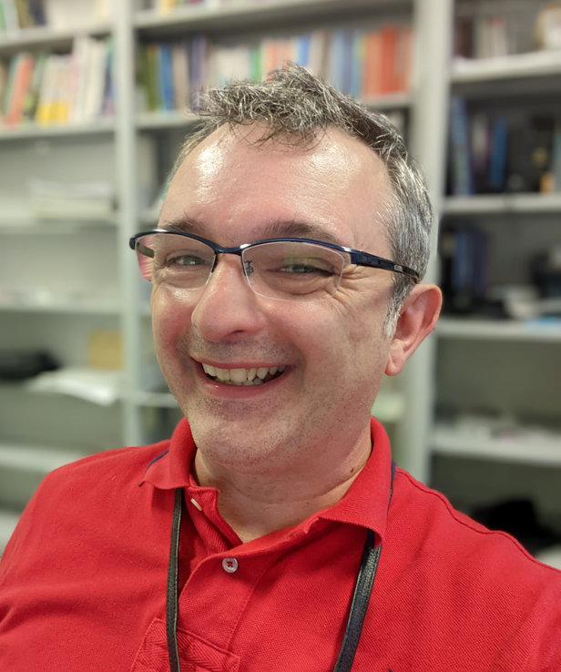

__Ian Willey__ - Promoting International Posture in Japanese University Students

 

__Abstract:__ The presenter will discuss two studies in a project aiming to develop a university English curriculum grounded in International Posture-building, using a survey designed by Yashima (2009). In the first study, the International Posture scores of students in first and second-year English courses were assessed, and a relationship between International Posture and gender, English proficiency, and major was examined. In the second study, pre-/post-course surveys were conducted to determine if “speaking to the world” activities, in which students expressed and shared their opinions about diverse topics, boosted students' International Posture scores. Attendees will then have a chance to share their own methods of promoting International Posture in their students.

 

__Bio:__ Ian Willey has an MA in TESL from Kent State University and a PhD in second language writing from Hiroshima City University. He is currently an associate professor at Kagawa University. His research interests include English for Specific Purposes, Medium of Instruction, and International Posture.  

 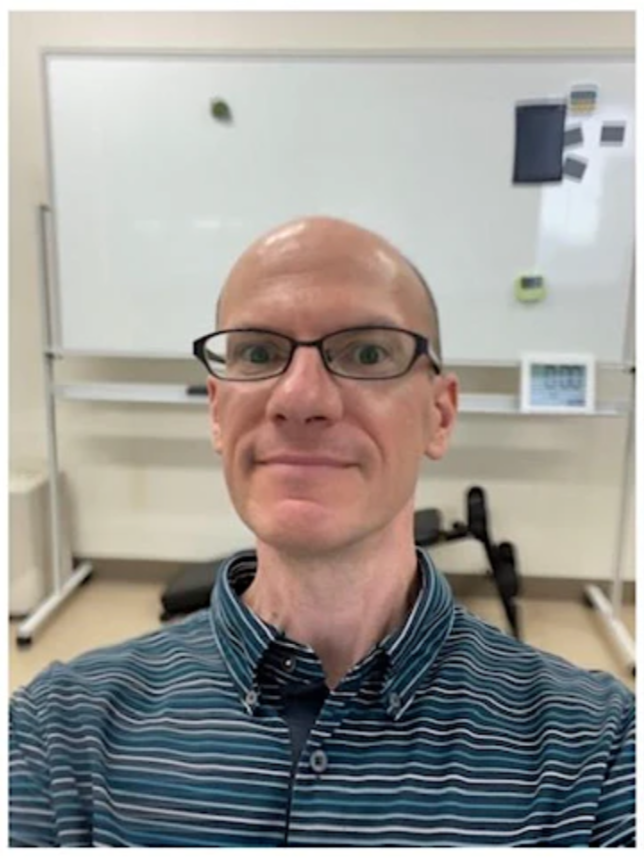
 

*******************************************************

 

## September 17, 2022  (Saturday from 1pm) 

__Omar Chin (Canada) & Clare Butson Kaneko (Niigata JALT and newly elected president of JALT!)__ 

## __Omar Chin__ 

__Title:__ How did I get here?  Assistant Language Teacher in Japan to licensed public school science teacher in Canada

__Abstract:__ If it’s in you to give, then please share.  If it’s in you to teach, then teach.  If the well of motivation is overflowing within you to achieve ‘a thing’, then every small step will bring you closer to destiny. It is your authentic self, the passion in your teaching, the strength of your example, and the growth you experience year after year which enriches this profession and the students you hope to reach.

This presentation outlines the journey of a Canadian teacher who spent six and a half years in Japan. He returned to Canada in 2014 to pursue additional qualifications; reached a full-time permanent public-school position; and is challenged by the strata of abilities in each new group of bi-lingual and sometimes tri-lingual students.  After 5 years of teaching the subject of science, the commonalities between and among all subjects being taught in a school is blindingly clear.  Whether it is English, math, history, science, or others, what matters is that students acquire vocabulary, thinking skills, and the meaningful exchanges and experiences which allow for self-driven discoveries – all of which serve as the foundation for further growth.  A teacher (and school administration) must also grow along with students; aim to differentiate and accommodate for multi-level classes; and aim to increase access from a “<em>Universal Design for Learning</em>” point of view which may integrate technology in some form (provided that students, their families and schools have the financial means to do so).

This teacher’s philosophy of teaching (<em>with influences from John Dewey, and other education theorists such as H. Gardner, J. Bruner, L. Vygotsky, and B.F. Skinner</em>) and his teaching strategies, methods to motivate students, and demonstrations of technology integration in the classroom, will be offered in this session.  The enduring trial for all teachers is to improve literacy and numeracy, for all skills – indeed all knowledge, whether acquired within the traditional school environment or beyond its walls, especially – are intertwined in support of each other.

__Bio:__ Omar Chin is an Ontario Certified Teacher.  Since 2017, he has been teaching science at the James Bay Eeyou School in an indigenous community, The Cree First-Nation of Chisasibi, in the province of Quebec, Canada.  A major steppingstone in his teaching career began in the fall of 2007 in Suwa, Nagano, Japan where he worked for AEON East Japan.  He later transitioned to WinBe (Tact Group) where he spent 4 years as an adult and children’s English conversation teacher. In 2012, he became an ALT at Fujimi Junior High School in Nagano (AtoZ Corporation).   His background also includes a Bachelor of Fine Arts from Ryerson University in Toronto – this Arts background and skillset are major influences in his approach and design of activities and experiences for students.

 

## __Clare Butson Kaneko__ 

__Title:__ CLIL

__Abstract:__ How can we encourage our students to use the English they have and take autonomy for their own learning? With a focus on teaching content, and useful new language, in conjunction with existing language aimed at the level and interests of our students, we can create a learning environment students will not only enjoy, but that will help them take responsibility for their language learning. 

Content and Language Integrated Learning may be mistaken as teaching subjects using English as the medium (EMI), but with the underlying CLIL goals of “increasing subject matter knowledge” as well as “language and language skills”, I believe there are many different ways we can use this teaching approach in Japan.

In today’s presentation I will share with you my experiences of using CLIL in the Japanese English Language classroom in both high school and university, and hopefully you will find some new ideas to take into your classroom.

__Bio:__ Clare Kaneko holds a master’s degree in TESL / TEFL from the University of Birmingham. She is currently the president elect for the Japan Association of Language Teaching. Clare has been working in English education in Japan in a variety of contexts since 1999. This includes teaching at both private and public schools, students aged 2 to 75. Her approach to English teaching is to have students express their true selves through the use of English, as well as encouraging students to think critically on all issues that arise in the language classroom. 

***************************************** 

## July 2022: Listening
 

### Event Date: July 2, 2022 at 4:00 pm

__Location:__ Yokohama Youth Center at Kannai Hall and Online 

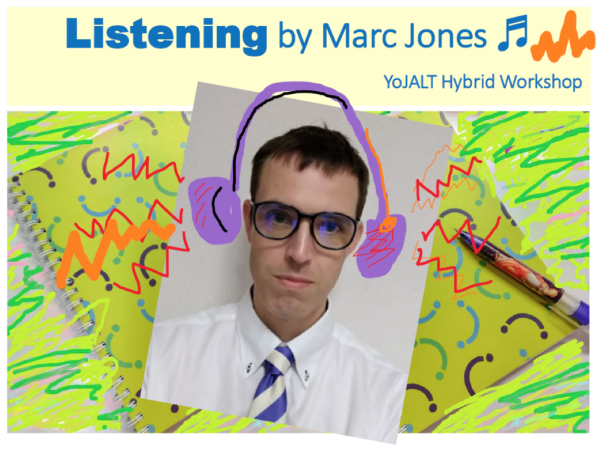

__Title:__ Teaching Listening from the Bottom Up and Top Down

 Listening seems to be taught quite often as if it were a skill that automatically transfers from one's first language to any other being learned. Unfortunately things are not quite so simple. The sound systems of Japanese and other languages, particularly European languages including English, can be very different with sounds that are present in one language being completely absent in the other. Additionally, how discourse is organized can be very different, too, and both these differences contribute to listening difficulties among language learners.

 In this talk, ways to facilitate phonology acquisition to make listening easier will be explored. In particular, the ways that visuals can assist learners, possible limitations, how the use of reading and writing to help learners can be productive (or not). Research from my myself and others will be used to illustrate some points, but overall this is an interactive session. Questions are welcomed during the session!

 The second part of the session looks at top-down listening, looking at a whole text, and how instructing learners about speaking genres and expectations can assist them in filling the blanks in their listening. The strengths and weaknesses of these approaches, the use of metacognitive strategies (thinking about thinking), and the use of top-down and bottom-up approaches together will be explored.

__Marc Jones__  teaches English at Toyo University in the Department of Global Innovation Studies. He has previously worked in Business English, junior high and high school and teaching young learners. His interests are phonology acquisition, listening, and research methods for classroom teachers. 

### Special guest speaker

__Noah Yoshimura__ 

__A 6th grade student presents his research: Can video games improve concentration?__

Many people have a bad image of video games. The WHO is concerned about video game addiction. Two years ago, Kagawa Prefecture instituted a "one hour a day for games" policy. However, my friends and I can communicate with people all over the world while playing games, and children can learn language, math, history and other things with games. A school principal in Japan found that reading books improved memory more than by playing video games. I decided to investigate the effects of video games and reading in order to think about how to improve education using games.

*******************************************************

June 2022: My Share

### Event Date: June 26, 2022 at 1:00 pm

Location: Online

Join us as fellow members and teachers share practical ideas for language teaching and learning that you will be able to take back to your classroom,  followed by Q&A and discussion.

__Catherine Sudo - Google Docs, YouTube and the Modern KWL Chart__

(online more convenient, but can do in person if someone is able to help her set up a computer at the venue)

__Abstract__ 

Working __Title:__  "Google Docs, YouTube and the Modern KWL Chart"

Language educators teach a mixed bag of lessons, sometimes with young adults in the morning and children in the evening. A few pedagogically sound, adaptable activities can go a long way. In this workshop, I will discuss how I’ve infused Know-Want-Learn (KWL) graphic organizers, a paper-based activity introduced in American elementary schools in the 1980s,  with technology to facilitate online and hybrid Academic Reading and Writing lessons for non-native English language learners at an American university.

__Short Bio__

Catherine Sudo (MSEd TESOL; New Jersey state certified K-12 English and special education) is an instructor in the Bridge Program at Temple University Japan.

__Extended Bio__

Catherine Sudo, MSEd TESOL, is a dual certified K-12 English and special education educator from the state of New Jersey who has been living in Tokyo since 2006. She has been teaching English and writing curriculum for 18 years in public, private, and international schools and corporations to children, adolescents and adults in both the U.S. and Japan. She is currently an instructor at Temple University Japan’s Bridge Program, organizer of Roppongi Cooperative Playgroup for international families of preschoolers, and co-organizer of Yoyogi Chapters, an English literacy coop for elementary and middle schoolers.

__2) Timothy Ang - Hyperdocs__ 

__Abstract__ 

English textbooks limit what English teachers are truly capable of teaching. The author proposes more emphasis be given to creating their own content from different sources. Once accomplished, the most effective way to organize and distribute this content is by sharing a Google Document with links and content. This “Hyperdoc” becomes the central piece of an engaging, inspirational, and educational class.

__Bio__ 

Timothy Ang has a Masters in Bilingual and Multicultural Education from the University of Alcalá. He teaches English part-time at Kansai University, Kwansei Gakuin, Osaka Gakuin, and Otemae University. His current interests include Task Based Learning, Student Motivation, Computer Assisted Learning, and Curriculum Development.

__3) Nicholas Wilson - Using Duolingo with Younger Learners__

__Abstract__

Duolingo is a language-learning app that uses gamification to increase learners’ motivation and engagement. Is there a way for teachers to use this tool with their students? In this presentation, I will show how to easily setup the platform, and the ways you can use it both inside and outside of the classroom.

__Bio__

Nicholas J. Wilson is an elementary and junior high school English teacher and curriculum developer fostering students’ digital literacy through foreign language education. He is a Level 1 & 2 Google Certified Educator and Level 1 Adobe Creative Educator in charge of supporting the professional development of English and Japanese teachers as a mentor, area leader, and member of the local board of education’s Digital Transformation Committee. His current research focuses on exploring the potential of the metaverse as a learning environment. He is also an active JALT officer involved in planning, promoting, and coordinating regional events and national conferences, and the founder and organizer of ALT Agorà, a series of monthly webinars designed for assistant language teachers, part of the ALT Training Online grassroots initiative.

 
4) Jennifer Toews-Shimizu - Engaging students in collaborative Teacher/Student OER &lt;Idea to Implementation&gt;__ 

__Abstract__
OER (Open Educational Resources) are digitized materials that are offered freely to educators, students and self-learners to use in teaching, learning and research. Open licences of varying degrees (CC) are meant to make development, implementation, use and distribution more accessible and promote <a href="https://sdg4education2030.org/the-goal" target="_blank" rel="noopener noreferrer">SDG4</a> according to <a href="https://www.oecd.org/education/ceri/" target="_blank" rel="noopener noreferrer">Centre for Educational Research and Innovation - CERI - OECD</a>. While many institutions are experiencing an influx of teacher produced materials (textbooks, etc), the idea of including students in content development is also growing. The idea is that when students contribute to course content, their perspective offers invaluable insight to both fellow learners as well as the teacher. To deepen learning experiences, the idea of collaborative student-teacher OER is emerging as can be seen in <a href="https://opentextbooks.library.arizona.edu/hrsm/" target="_blank" rel="noopener noreferrer">this open textbook</a> used/created at the University of Arizona.

__Bio__ 

Jennifer Toews-Shimizu currently works at Toyo University in Tokyo. She has taught and developed curriculum for primary, junior high and university levels in both Canada and Japan. Her research interests include OER, FLA, testing and assessment for young learners, student motivation, and professional development for teachers. In her private time, she is training in instructional design to create interactional, experience-based eLearning such as <a href="https://sites.google.com/view/instructional-design-jennifer/home" target="_blank" rel="noopener noreferrer">this</a>. She is the founder of<a href="http://www.bricolageteacher.come/" target="_blank" rel="noopener noreferrer"> www.bricolageteacher.com</a> which is a web page and social media service dedicated to supporting OER and an interactive settings for peer support and learning amongst educators.

__5) Yaoko Matsuoka - Critical perspectives towards the use of Open Educational Resources (OER) in the age of digital university__ 

__Abstract__

While our recent study has found students’ positive perceptions about paper textbooks, it also suggests adopting instructional materials from broader sources. We focus on Open Educational Resources (OER) as one possibility to fill in the shortcomings of the current use of materials in Japanese university English as a foreign language (EFL) courses. Japan’s open education was primarily led by the national government in the lifelong-learning framework, while institutions implemented OER for extracurricular activities. The use of OER appeared to have close relation with cross-cultural contexts and perspectives, which may be why OER is yet to be pervasive in regular EFL classes in Japan’s higher education. Despite the worldwide recognition of OER and its overwhelming strength, being free and open to all, its problems regarding the authors’ motivation, copyright, and quality assurance are often debated. This presentation critically discusses how OER is used in the Japanese EFL context and seeks possible factors disturbing the OER adoption in Japanese undergraduate EFL courses.

__Bio:__ Yaoko Matsuoka, PhD. (International Christian University)  [Presenting]

Dr. Matsuoka has long served as Research Fellow at International Christian University. Recently retiring from Kokugakuin University, she currently teaches at a U.S. online university. Her research includes pragmalinguistics, L2 writing, and the use of L2 materials in online instruction.

Hiroyuki Ida, Ph.D. (Josai University)  [Not Presenting]

Dr. Ida is an assistant professor of Josai University. His PhD thesis focused on academic literacies, but he is currently expanding his research into the role of material use in EFL context.

If you would like to present, please prepare a 10-15 minute presentation on a practical learning technology teaching topic – an activity, some materials, an app or website – anything other members might find useful. To book a slot, please email <a href="mailto:assistantprogram@yojalt.org" data-cke-saved-href="assistantprogram@yojalt.org">assistantprogram@yojalt.org</a> with a 50-75 word abstract and a title with a 25 word bio. If there is time at the end, it may be possible to squeeze in a few last minute speakers, but to avoid disappointment please reserve early.

*****************************************

## May 2022: Owning Your Own School

___Event Date:__ May 29, 2022 from 1 pm to 5 pm                                                  
__Location:__ Online (Zoom)

Come and join us on May 29th to learn more about owning your own school in Japan with two presentations in an event co-sponsored by the JALT School Owners SIG.

 Employee to Business Owner  in English Education   Presented By Kenny Fritts

 

Kenny Fritts will look at how English speakers in Japan can transition from employee/teacher to owner. A career as a standard ALT or Eikaiwa teacher isn’t going to make for a comfortable retirement. Working long-term as an ALT or at an Eikaiwa in Japan comes with great risk as we age. We will look at different paths and opportunities to successfully transition from employee to owner/operator to business owner.

Questions to be answered include:

<ul>
* Who is likely to be successful at starting an English school business?
* Why, when, how to start an English school business?
* What are the risks/rewards of starting an English school business
</ul>

<em style="font-size: 1em; font-family: var(--font-base, 'Source Serif Pro', 'Baskerville Old Face', Garamond, 'Times New Roman', serif);">

Kenny Fritts has started, bought, and sold multiple English school businesses in Japan. Kenny is the director of KK Head Start System. KK Head Start System operates and provides international preschool franchising opportunities under the Head Start International Preschool brand. KK Head Start System prepares and assists employees of Head Start International Preschools to become successful franchise owners.</em>

### Education as a Business – School Owner Simulation Presented by Ryan Hagglund

Most teachers at some time have thought about running their own language school or wondered what it would be like.  What would it entail?  What might a successful model be?  How might it differ from education in the non-profit world?  This presentation will utilize a simulation style to highlight challenges and benefits unique to for-profit language schools.  Participants will engage in decision-making scenarios and opportunities, observing how they affect both the educational and financial aspects of education as a business.

<em>Ryan Hagglund is owner of MY English School in Yamagata and has also taught at Yamagata University.  He has an MA in TEFL/TESL from University of Birmingham in England, MAT from Willamette University in Oregon, and Oregon State teaching certification for JHS and HS.  He lives in Yamagata with his wife and three boys.</em>

There will be a joint Q&A session after both presentations have been concluded. 

***************************************** 

## February 2022: Dr. Jackie Steele (via Zoom)
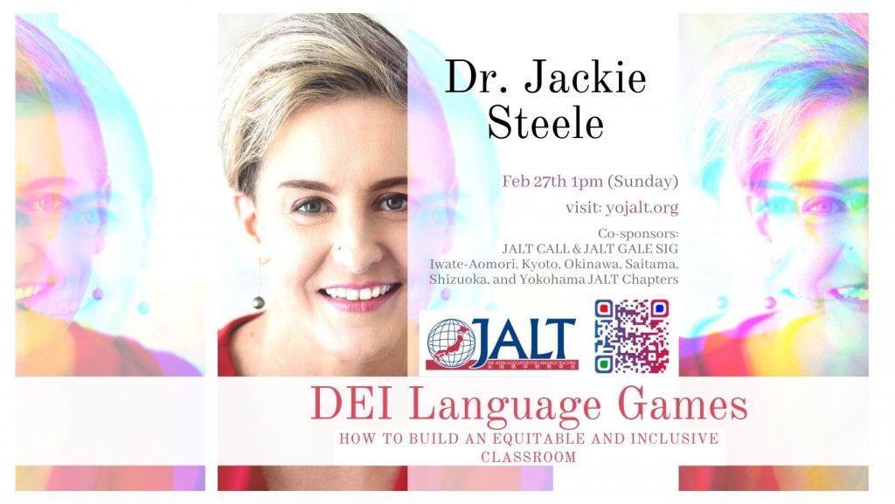

__Event Date:__  February 27, 2022 Sunday, 1pm 

__Location:__ Online

__Come and join us on February 27th for our event with Dr. Jackie Steele.__ 

__Co-sponsored by the JALT CALL and GALE SIGs and the Iwate-Aomori, Kyoto, Okinawa, Saitama, Shizuoka and Yokohama JALT Chapters.__ 

 

### About this event

### DEI Language Games: How to Build an Equitable and Inclusive Classroom

__“Diversity Feminist Language Games and DEI Tactics to enrich EFL Pedagogy in Japan”__

In English as a Foreign Language teaching, how can we mobilize and teach a democratically inclusive form of the English language and simultaneously raise awareness of intersecting systemic inequalities as a matter of diversity-positive pedagogy? Few mother tongue anglophones and few EFL professors have formal training in critical race theory, critical feminist theory, queer theory, disability studies, nor in social justice topics pertaining to contemporary diverse citizenship and democratization. When we are teaching our mother tongue in a foreign country, do we continue to reflect and convey the inegalitarian patterns used by most of our peers, or do we have a higher responsibility to educate ourselves and our students about how to speak English in a way that conveys respect for diversity, rule of law, and the constitutional commitments to democratic equality, non-discrimination, and intersectional equity that form the backdrop of our societal tissue? Where does linguistic pedagogy intersect with civics, ethics, and social justice?

Language has power. Many accomplished instructors of the English language and professors of linguistics working in Japan may unknowingly convey and repeat discriminatory “language patterns” that in fact perpetuate and sustain inequitable power relations between and across social groups. Channeling the power of privileged groups, certain types of language patterns pass for “normatively neutral,” when in fact they are part and parcel of the discursive “language games” needed for inequitable power relations to be sustained by stealth. We know that language or linguistic representations indirectly proselytize discriminatory views of “normalcy”, “respectability”, “typical family formation”, “normal bodies” and/or “true citizens”. These representations can be deceptively misogynist, patriarchal, homophobic, ethno-racist, and colonizing of our democratic rights to equality.

With greater awareness of how anti-democratic English “language games” are passed on through legacy EFL curriculum, we can begin to draw upon and integrate civics lessons from constitutional democracy, intersectional ethics from feminist legal scholarship, and disruptive tactics from diversity feminist movements and anti-oppression scholarship. These various DEI awareness strategies and tools can empower our language teaching in ways that positively raises 1) diversity and equity awareness, 2) linguistic competence, 3) equitable EFL change agents who will bring greater understanding to these thorny issues of democracy and raise the literacy of the growing, global, English-speaking community. 

## __Educator Profile__

Dr. Jackie F. Steele is a trilingual political scientist and international speaker who has taught at leading universities in Canada and Japan, including six years as associate professor at the University of Tokyo. As CEO of enjoi Japan K.K. Dr. Steele guides corporate leaders in diversity and equity for innovation (DEI) as a holistic business strategy that leverages evidence-based approaches and metrics tracking psychological safety, EQ leadership, diverse talent mobilization, and intersectional equity in corporate policies and practices.

In her volunteer life, Dr. Steele is a governor with the Canadian Chamber of Commerce in Japan, an Angel Investor with SheEO Canada, President of FEW Japan supporting women’s empowerment, and Director of the LGBTQ Chamber of Commerce in Japan. To support the next generation of intersectional diversity leaders in Japan, she serves as the Strategic Advisor of WomEnpowered International hosted at GRaSPP (UTokyo). 

Dr. Steele holds a PhD in political science (la pensée politique) from the University of Ottawa and a masters in law. She has published over thirty academic works, is a longtime collaborator of the Canadian Embassy in Tokyo, and is an advisor to UN conferences focused on gender equality, diversity, and disaster/crisis risk governance.

## 2022: Language in Action (via Zoom)
<a href="https://www.eventbrite.com/e/language-in-action-tickets-249901430907?utm-campaign=social&utm-content=attendeeshare&utm-medium=discovery&utm-term=listing&utm-source=cp&aff=escb">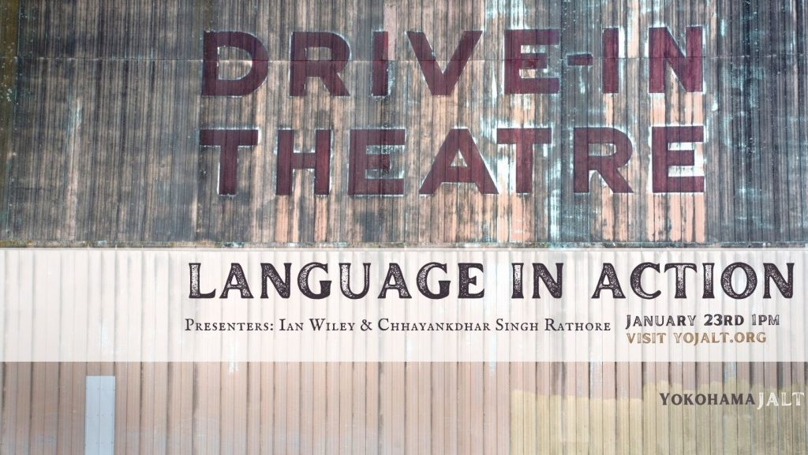></a>January 

__Event Date:__ January 23rd Sunday, 1pm __

__Location:__ Online
__Come and join us on January 23rd for our event focusing on Language, Learning, and Drama.__

## About this event 

## Event Theme:

We'll be sharing practical ideas for language teaching and learning through the perspectives of live improvisation and process drama. Join us and our two guest speakers Ian Willey and Chhayankdhar Singh Rathore for a discussion on various language teaching and learning ideas to take back to your classroom.

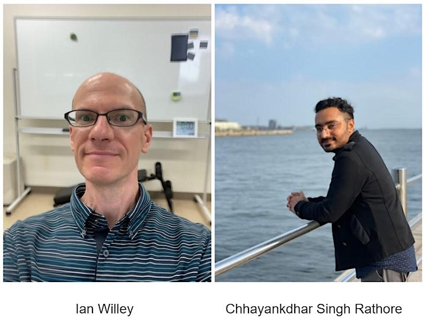

## Speaker 01

__Title:__  Motivating Action through Applied Improv

Speaker: Ian Willey; Kagawa University

__Abstract:__  Exercises from improvisational theater have gained attention in educational fields for their capacity to promote empathy and communication skills among learners. The presenter will first describe a study that sought to identify whether weekly use of these “applied improv” exercises in English classes boosted Japanese university students’ compassion scores, with compassion defined as empathy combined with a willingness to act. Positive gains in compassion scores were identified. Attendees will then be able to experience several of these fun and simple exercises and games, which can be done in three- to five-minute sessions in both face-to-face and online classes. Attendees will leave the presentation equipped with a repertoire of quick activities to energize students and enable them to speak and act promptly in future communicative encounters.

Biography: Ian Willey is an associate professor in the Higher Education Center at Kagawa University. He has an MA in TESL from Kent State University and a Ph.D. in International Studies from Hiroshima City University. His professional interests include English for specific purposes, medium of instruction, and in-service learning. He is currently in charge of a MEXT-funded project to boost the international posture of Japanese students and faculty.

## Speaker 02

__Title:__  Process Drama in the Language Classroom

Speaker: Chhayankdhar Singh Rathore

Institutional Affiliation: Konan Women’s University, Kobe

__Abstract:__  In this online workshop, the presenter will introduce how process drama can be used in the language classroom. Through a chain of interconnected activities, the participants will explore the structure of process drama and discuss its application in the language classroom. The participants will be offered a hands-on experience of a variety of activities from the process drama repertoire. These activities have been selected to respond to the concerns of language teachers with regard to educational drama such as difficulty in incorporating course materials in drama activities, difficulty in incorporating reading and listening skills in drama activities, and inability to take drama beyond icebreakers and warm-up activities.

While the structure of the workshop will be provided by the facilitator, the contents will be largely determined by the participants. So, participants are requested to come prepared for active engagement with their cameras on and have a pen and paper at the ready.

Biography: Chhayankdhar Singh Rathore is a lecturer at Konan Women’s University in Kobe and a drama-in-education practitioner who utilizes a variety of educational drama techniques such as process drama, role play, radio drama, skits, in-role writing, and simulation along with other performance-in-education activities such as presentations, debates, speeches, storytelling, and podcasting. He has presented extensively on different facets of drama-in-education and finds inspiration in the positive feedback from workshop participants. He is a graduate of St. Stephen’s College (University of Delhi) where he read English Literature and Political Science. He graduated from the M.A. TESOL program at Soka University, Japan.

*******************************************************

## Presentations from 2021

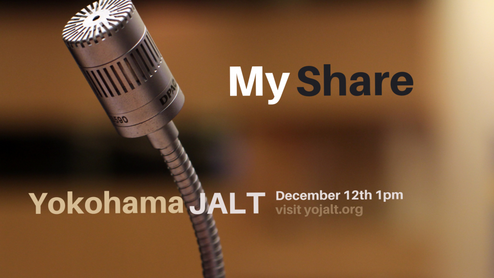

__Event Date:__ December 12 Saturday, 1pm

__Location:__ Online

__Event Theme:__ 

We'll be sharing practical ideas for language teaching and learning. Join us to hear seven short talks on various language teaching and learning ideas to take back to your classroom, followed by Q&A and discussion.

Schedule of presentations:

* Improving Tertiary EFL Students’ Motivation through Translanguaging Practices (13:00-13:15) Presenter: Ma. Wilma Capati, Soka University
* Developing Students’ Confidence Through Extensive Listening (13:20-13:35) Presenter: Agnes Maria Francis, Soka University
* Insight into the Students' View of Writing Feedback Styles (13:40-13:55) Presenter: Grant Thomas, Westgate
* Teaching lower-level students online (14:00-14:15) Presenter: Brooks Slaybaugh, Tokyo University of Science
* An Introduction to the Implementation of VR Technologies in English Language Education (14:30-14:45) Presenter: Daniel Jupp, University of Toronto OISE
* Using Flipgrid to Promote Lively Presentations and Q&A Sessions (14:50-15:05) Presenter: Margalit Faden, Tokai University
* Improving second language learners' situational conversation willingness and ability through visual materials (15:10-15:25) Presenter: Lu CHEN, Waseda University

## YoJALT Informal Discussion Event

November 28th 1pm start

 Come for this casual conversation event about topics ranging from the JALT International conference, what we've learned this year, surviving the pandemic (whether it be on Zoom or face to face), books we've read or anything else you'd like to chat about! BYOB!

 Time: Nov 28, 2021 01:00 PM JST

## October 3, Sunday, from 13:00: 
## YoJALT Pronunciation workshop with Jason Pipe (via Zoom)

__Abstract__

Research informs us that pronunciation can and should be taught as it is an important part of communication. With attention drawn on this aspect of second language acquisition, a speaker can become more intelligible despite errors in other aspects of speaking such as vocabulary, grammar and pragmatics. Poor pronunciation, on the other hand, would more than likely lead to communication breakdown or misunderstandings in ELF interactions. Unfortunately, there would seem to be no clear or specific teaching methodology which deals with the application of pronunciation training into the classroom. Teachers often gloss over this part in their EFL classes, electing to focus on activities that stretch communication and build knowledge in grammar and vocabulary. However, instruction on pronunciation as well would certainly benefit the student and lead to greater motivation. In this workshop, I will explain why pronunciation needs to be taught explicitly, applied regularly in class and observed carefully through the framework, Timed-Pair-Practice. Hopefully, this workshop will provide some useful and practical insight into how to raise student awareness in their spoken language production and how teachers can focus their attention better on specific aspects of phonology.

__Bio__

Jason Pipe is from England. An experienced university lecturer from the UK and qualified high school teacher, Jason is currently a Special Professor at Tokyo Keizai University where he teaches EAP, business, marketing and preparatory studies for students studying and working abroad. His research interests include sociolinguistics, task-based learning, metacognitive learning, motivation and phonology. As a PhD.  candidate at UNICAF University, Jason’s present research focuses on development of teaching pronunciation and the measurement and development of speech fluency in language learning, and its relationship with other aspects of linguistic performance including pausing, repair and phonological language production at the suprasegmental level.

Jason on the web:

<a href="https://iamsoundingenglish.com/">I am sounding English – Getting you better understood</a>

<a href="https://www.linkedin.com/in/jasonpipe/">Jason Pipe | LinkedIn</a>

## __September 4, Saturday, from 13:00__: 
## Ways to Approach Professional Development event (via Zoom) 

__Abstract:__

This seminar will be a two-part session focusing on forms of teacher professional development (PD) at both the individual and institutional level. Attendees will be given opportunities throughout both parts to engage in their own PD and discuss what is applicable to their own contexts. The talk will begin with a brief introduction to PD definitions and effective practices. Following that, Adrianne Verla Uchida will lead a session introducing the tools of reflective practice (e.g. concept maps, action research) as a form of PD, with a specific focus on critical friendships. For the final session, Jennie Roloff Rothman will describe an instance of institutional-level PD and give suggestions on how it can be adapted to other contexts. This session is designed to be practical and interactive, so participants should come ready to share their experiences and ideas while being unafraid to ask questions.

__Bios:__

__Adrianne Verla Uchida__ is an Assistant Professor at Nihon University. She earned her MA TESOL from Teachers College, Columbia University. Her research interests include reflective practice, teacher development, language teacher identity, and curriculum development. 

__Jennie Roloff Rothman__ is Principal Lecturer of Professional Development-Teacher Development at Kanda University of International Studies. Her MA TESOL is from Teachers College, Columbia University. Her research interests include faculty development, teacher development, critical thinking and global issues in the language classroom.

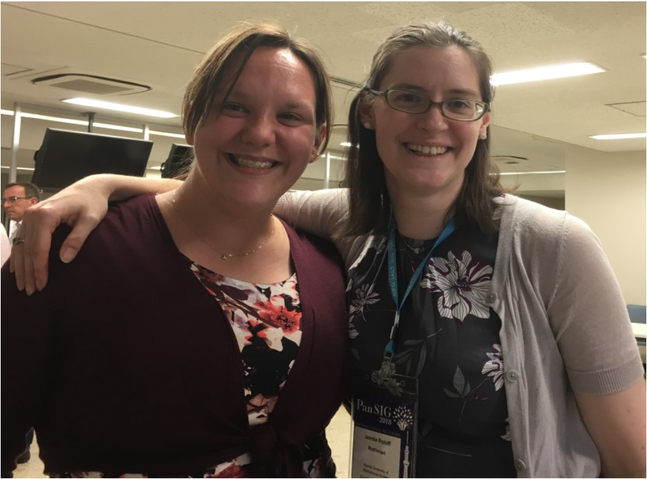
Adrianne Verla Uchida & Jennie Roloff Rothman

## July 3, Saturday, from 13:00__: Neurodiversity in Education: JALT Yokohama and Kobe chapters joint meeting (via Zoom) 
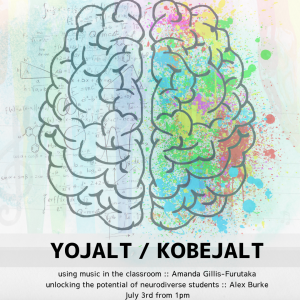

Two topics: 

* Teaching all of the students - unlocking the potential of the neurodiverse   students hidden in your language classroom
* Using music in the classroom & neural diversity 

### Speaker 1: Alex Burke

<imng src="images/thumbnail_AlexBurkePortrait-300x300.jpeg">

__Title:__  Teaching all of the students - unlocking the potential of the neurodiverse students hidden in your language classroom

__Outline:__  This workshop will give an introduction to what neurodiversity means, some hands-on experiences to understand what it’s like to be a neurodiverse person, hear some first hand accounts, and then the chance to talk and share about how you might use this in your classrooms. 

__Bio:__ Alexandra Burke has taught every level of the Japanese public education system from kindergarten to university since 2005, including thousands of hours of team and solo teaching. Burke has closely observed classroom interactions, and talked with students about what helps or blocks their autonomy and confidence. Based on wide reading of international best practice on neurodiversity and inclusion, in collaboration with Japanese colleagues, she has trialed a number of culturally appropriate changes to methods and classroom management. Her professional background is how government systems are designed and used to turn goals into services that reach the populations who need them. She has presented within Japan, overseas and is currently teaching English to future teachers and non-English majors at three universities in central Japan. At JALT 2020 she won two Michele Steele Best of JALT Chapter Awards for inclusive teaching presentations. She also won Best Poster awards at the 2019 and 2020 JALT International.

### Speaker 2: Amanda Gillis-Furutaka
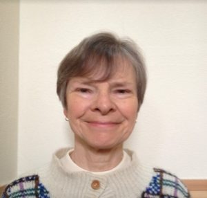

__Title:__  Music in our brain and in the language classroom
__Outline:__ What is music? How and why do we respond to music in different ways? Why do some people think that they are not “musical”? Why should we all use music when teaching languages? This workshop will challenge you to explore these questions. The presenter will explain how our brains process music, provide suggestions for original ways to include music in language lessons, and invite everyone to share their own insights and recommendations.
 

__Bio__: Amanda Gillis-Furutaka is a professor in the Faculty of Foreign Studies at Kyoto Sangyo University. She has an MA in TESOL from the University of Birmingham and a PhD in Music from the University of London. She is also Program Chair of the JALT Mind, Brain, and Education (BRAIN) SIG. She enjoys nothing better than the chance to combine her three passions: learning about the brain, teaching languages, and exploring music of all genres.

## June 2021: Tech My Share (via Zoom)

__Event Date:__ June 12 Saturday, 1pm __

__Location:__ Online

__Event Theme:__ 

We'll be sharing practical ideas for language teaching and learning. Join us to hear five short talks on various ideas using technology to take back to your classroom, followed by Q&A and discussion.

Schedule of presentations:

* The Role of Paper-Based Materials in Online EFL Teaching Environment: Yaoko Matsuoka, International Christian University, Hiroyuki Ida, Josai University
* Different Modes of Multimodalities in EFL class activity: Tomotaka Shiroyama, Nagoya Women’s University and is a University of Exeter MPhil student
* Designing and Establishing Simple Educational Websites: Margalit Faden, Department of International Studies, Tokai University
* Using data-driven learning to aid in academic writing: Sarah Deutchman, Waseda University
* A drawing app for teaching from a textbook over Zoom: Steve Paton, Fukuoka University

__Details for main event:__  If you would like to present, please prepare a 10-15 minute presentation on a practical learning technology teaching topic – an activity, some materials, an app or website – anything other members might find useful. To book a slot, please email <a href="yojaltpresident@yojalt.org">yojaltpresident</a> with a 50-100 word abstract and a title. If there is time at the end, it may be possible to squeeze in a few last minute speakers, but to avoid disappointment please reserve early.

##  

## May 2021: Raising Bilingual Children & Young Learners
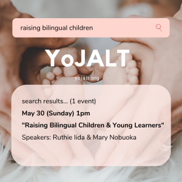

__Event Date:__ May 30 Sunday, 1 pm __

__Location:__ On Zoom

__Speakers:__ Ruthie Iida and Mary Nobuoka (details to be provided)

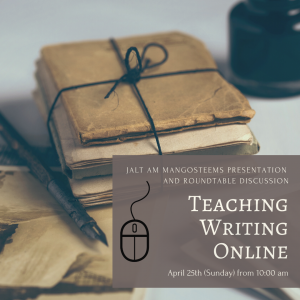

## April 2021: Teaching Writing Online (via Zoom)

__Event Date: __April 25 Sunday, 10:00 am__

__Location:__ On Zoom

## February 2021: Drama in the EFL Classroom

<imng src="images/Drama-02-300x300.jpg">

__Speakers:__  Chris Parham and Eucharia Donnery

__Date:__  February 6th, Saturday

__Time:__  1pm-

__Location:__ On Zoom!

- - Free for both JALT members and non-members - -

### First speaker: Chris Parham

<imng src="images/Chris-Parham-219x300.jpg">

### __Using short plays to teach English:__

Are short plays of any use to students in the English language classroom?  During the pandemic I wrote 10 shorts plays and used them in one of my online lower intermediate universities classes during second semester.  Before class students were assigned the task of reading the chosen short play for the week and writing a synopsis of the plot, and when students ‘entered’ the classroom they undertook a range of activities including - a cultural presentation (on the theme of the play), a rehearsed reading, comprehension questions, vocabulary and storytelling activities, language focus, role play and post discussion.  This workshop is in two parts.  First, we try out some of the activities I have mentioned - read one play as a group, review the comprehension questions,  reread the play in pairs, and finally undertake some of the communicative and language activities.  Second, I will briefly introduce the rest of the plays and some of the other activities I did to supplement the term - including reviewing a recorded play, and writing and performing a short play in small groups on Zoom.

 This workshop is for students and teachers of EFL.  Hopefully, participants will find something of relevance for their online teaching.

Chris Parham is from London. He mainly works at Aoyama Gakuin University but also teaches at Daitō Bunka University, KIFL, Shirayuri University, Temple University and Aichi Sangyo University.  Before the pandemic he was very active with his theatre company Black Stripe Theater.

### Second speaker: Eucharia Donnery

### __Coping and Teaching during a Pandemic: Process Drama Workshop__

How can we best support our students’ linguistic learning journeys as we simultaneously struggle with our own teaching online during a pandemic? Process drama is a highly structured technique that can be used to explore various social themes, and this workshop helps participants to explore the ramifications of Covid 19 in a psychologically safe environment. This workshop starts with self-reflection, a mental self-scan of how teachers are adapting and coping with the new challenges of teaching online. It is aimed at teachers who are new to using drama: from energizing ice-breakers to project-based process drama, ending with cool-down activities.

 Part I of this workshop highlights how we can best engage and motivate our students during these unusual times through online drama-based activities in the mixed-ability Japanese EFL classroom.

Part II brings the participants through the structure of process drama, before working together in work together to explore the selected theme. This creates opportunities for participants to use language in situations and relationships within an online context.

Part III offers some ideas on how to close a process drama project by evoking a spirit of curiosity in the learners.

 Process drama projects can be freely adapted to suit many classroom environments as the major objective is to empower students in order to give a sense of ownership over their own linguistic journeys. Hopefully, participants will find something of relevance for their online teaching.

__Bio__

Eucharia Donnery is a lecturer of intercultural communication studies in Japanese and performance studies in English at the Department of Applied Computer Sciences, Shonan Institute of Technology, Japan. Her main research and supervisory areas are intercultural communicative competence, drama in SLA, Computer Assisted Language Learning (CALL).

## January 2021: Poetry Event

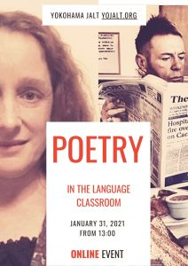

__Speakers:__  Quenby Aoki and Paul Hullah

__Date:__  January 31st, Sunday

__Time:__  1pm-

__Location:__ On Zoom!

- - Free for both JALT members and non-members - -

###  
### First Speaker: Quenby Aoki

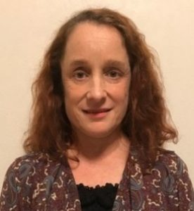

### __Presenting Personal Poetry in the Language Classroom__

Poetry, by definition, expresses emotion and aims to stir emotion in the audience, and performing dramatic poetry readings is both effective and enjoyable in the language classroom. This presentation explores ways that even beginning language learners can express themselves creatively through poetry, become more aware of the rhythm and intonation of the language, and develop increased confidence in public speaking. Sharing their poems, perhaps describing memories of a family member or another person with whom they have a close relationship, can inspire lively discussion on a range of topics and helps to build a supportive classroom community. 

__Quenby Hoffman Aoki__ teaches at Seikei University. She holds degrees from Georgetown University (Japanese Language) and California State University (Education/ TESOL), and is Coordinator of the JALT Gender Awareness in Language Education SIG.

Literature has always been her first love, and she regularly performs her poems at open-mic events in Tokyo.

### Second Speaker: Paul Hullah

### WHAT WE TALK ABOUT WHEN WE TALK ABOUT POETRY

 <a href="https://www.meijigakuin.ac.jp/english/staff/hullah/">Dr Paul Hullah, Meiji Gakuin University</a>

 __Abstract:__  Poetry’s problem resides in its name: ‘poetry’. Educators’ own preconceptions can be as deleterious an obstacle to classroom success as learners’ unfounded antipathies. Properly to mine the rich resource that poetry offers, we must first unlearn some useless notions and re-educate ourselves as to what poetry is.

 The defining difference between bona fide poetry and other forms of expression is not <i>what</i> it says, but rather <i>how </i>it says. Using poems for content alone (as many teachers do) can be a worse-than-redundant strategy. I will give examples, and showcase a self-developed ‘Litmus Test’ which painlessly detects: ‘Poetry, or Not?’

Biog:

An award-winning poet/musician himself, frequently performing at UK literary and arts festivals, Paul Hullah is tenured Associate Professor of British Poetry & Culture at Meiji Gakuin University. He was co-founder of Liberlit, the international conference forum for ‘Discussion and Defence of the Role of Literary Texts in the English Curriculum’ &lt;www.liberlit.com&gt;. He has published 14 EFL textbooks (all featuring ‘literary’ texts at their core), 7 volumes of poetry, and 4 books of literary criticism including ‘We Found Her Hidden: The Remarkable Poetry of Christina Rossetti’ (2016). In 2013 he received the Asia Pacific Brand Laureate International Personality Award for ‘paramount contribution to the cultivation of literature [that has] exceptionally restored the appreciation of poetry and contributed to the education of students in Asia.’ &lt;<a href="https://en.wikipedia.org/wiki/Paul_Hullah">https://en.wikipedia.org/wiki/Paul_Hullah</a>&gt;

*******************************************************

## Presentations from 2020

*******************************************************

## December 2020: My Share

__Date:__  December 12th, Saturday

__Presenter:__  You!

__Time:__  13:00 ~

__Location:__  On Zoom!

__Event Theme:__ 

We'll be sharing lots of practical ideas for language teaching and learning!

Join us to hear eight short talks on various ideas to take back to your classroom!

Titles: They and Them: Creating Awareness on using Pronouns through the ‘Stay Woke’ Phenomenon on Social Media; “Learning through the Looking Glass”: Methods to Provide Implicit Instruction through Self Transcription; Speaker Wants to Know; Comfort Zone vs. Challenge Zone in Language Learning; Applying pragmatic content to teaching English as a foreign language; Ideas for Zoom classes; and Issues in Teaching Discussion Classes.

### Yokohama JALT My Share 2020

Saturday, December 12, 13:00～16:00:

PROGRAM

### 1. Intercultural Communication Simulation - Face-to-Face and Online Implementation
### __Margalit Faden - Tokai University, Department of International Studies__ 

This brief talk introduces an intercultural communication simulation activity for undergraduate students. Both online and face-to-face implementation of the simulation will be explained. This activity encourages students to identify and explore conflict that arises in situations that involve intercultural communication while promoting the development of skills to cope with such conflict.

### 2. They and Them: Creating Awareness on using Pronouns through the ‘Stay Woke’ Phenomenon on Social Media
### Ma. Wilma Capati Soka University (13:20-13:35)
__Abstract:__  As social media continuously rises as the source of communication and information, the term ‘stay woke’ was coined to refer to the ability to be aware of social issues. Due to this, the use of nonbinary pronouns such as ‘they’ and ‘them’ are promoted online to identify people outside the gender binary. This presentation centers on creating awareness for EFL students on how to communicate with

the correct pronouns in accordance with the person’s identity. The fluidity of the language while using non-binary pronouns will be discussed for students to be socially aware and effectively use the language.

### 3. “Learning through the Looking Glass”: Methods to Provide Implicit Instruction through Self Transcription
### R DuPaty MA Student, Temple University (13:40-13:55)
__Abstract:__  English education in Japan has produced a great number of learners who pride themselves on their receptive abilities but often lack in their productive skills. Reasons stem from the exam-oriented curriculums in secondary-school to the fact that few opportunities exist for learners to practice their productive skills naturally within society. With this in mind, this presentation introduces an alternative method to productive processing which has the learners focus on their own spoken

utterances through self transcription in a way to reflect and improve upon what they say without having to have immense experience in a natural context with trial and error.

### 4. Comfort Zone vs. Challenge Zone in Language Learning
### Jon Shepard (14:00 -14:15)
__Abstract:__  Students benefit from structure and routine in the classroom, as these elements can enhance language learning. Yet, understanding how to invite the unexpected into a lesson can keep students engaged and involved...and allow for fluidity within the framework of structure. In this talk I hope to share practical ways to challenge language learners in the most positive way.

*********** BREAK ********** (14:20-14:30)

### 5. Applying Pragmatic Content to Teaching English as a Foreign Language
### Yaoko Matsuoka International Christian University (14:30-14:45)
__Abstract:__  This research presents practical ways of applying pragmatic content to English in foreign language courses for Japanese learners. Although L2 pragmatic competence is associated with learners with high language proficiency, it is possible to incorporate pragmatic contents into middle level class activities. Two activities based on politeness theory (<a href="https://psycnet.apa.org/record/1987-97641-000">Brown & Levinson, 1987</a>) and speech acts will

be introduced in the presentation: sentence creation and a matching game of speech acts. While politeness theory covers a wide range of politeness components, from lexical usage and hedges to honorifics and understatement, speech acts include request, ordering, apology, denial, and many other communicative acts that occur in our daily lives.

### 6. Ideas for Zoom classes
### Kishiko Nashimoto Musashino University (14:50-15:05)
__Abstract:__  In this presentation, some ideas for Zoom classes will be shared. First, it is very difficult to talk when students want to keep their cameras off at video classes. You can make classes more active and friendlier by appointing students as a facilitator. Second, it is troublesome to pre-assign students for breakout sessions. The easy way to divide students into predetermined groups will be presented. In

addition, some fun class and assignment ideas using YouTube will be discussed.

### 7. Inclusion of Suprasegmental Pronunciation Training in the EFL Classroom
### Jason Pipe (15:10-15:25)
The purpose of this paper is to highlight the necessity of including pronunciation training as an additional part of the EFL lesson. Although the challenges to this aspect of second language acquisition will be discussed from the perspective of the student and the teacher, it will become evident the importance in focusing on practicing pronunciation at the suprasegmental by concentrating on the

prosodic feature, stress. Strategies on how to effectively include this aspect of pronunciation training will next be considered followed by a closer look at the appropriate use of materials at the micro- and macro-levels. Further concerns faced by the instructors in the implementation of this pronunciation training will next be discussed but it will be concluded that the benefits of such training will be of great

benefit to the learner in becoming more proficient in English speaking and listening.

### 8. Issues in Teaching Discussion Classes
### Slaybaugh Brooks (15:30-15:45)
__Abstract:__  This presentation is about issues in teaching discussion classes. Included is a model from the professor Paul Grice, who wrote about what makes a good English discussion. The problem with this approach is that while it is appropriate in English speaking countries, it is inadequate in Japan, due to differing norms on directness and politeness. One solution to this problem is backchanneling, but these

depend on the culture, and so must be explicitly taught. Another solution is to tie grading with how well students can disagree and express their opinion.

## October 2020: Self Study

__Speakers:__  Louise Ohashi and James Underwood

__Date:__  October 24th, Saturday

__Time:__  1pm-

__Location:__ On Zoom!

- - Free for both JALT members and non-members - -

## Louise Ohashi

__Supporting Learner Autonomy through Planning-Action-Reflection Cycles__ 

__Abstract:__ Classrooms can be valuable learning sites but they are only one part of the language acquisition toolkit. In this workshop, we will explore ways for teachers to foster autonomous, out-of-class learning. Participants will be given guidance on how to adapt a basic planning-action-reflection cycle to their different teaching environments to help their students reach their learning goals. Furthermore, methods and tools will be introduced to help teachers facilitate each stage of the cycle in either a face-to-face or online environment. A range of online tools that teachers can recommend to students for self-study in English (and other languages for some of the multilingual tools) will also be introduced. Participants will be able to discuss the central topics in small groups and will also have the opportunity to try using some of the self-study tools during the session.

__Bio:__ Louise Ohashi (PhD) is an Associate Professor at Meiji University who specializes in TESOL. She is a CALL/MALL enthusiast whose doctoral thesis examines learner autonomy, motivation, the use of digital technologies for language learning, and the impact that formal education can have on these areas. She serves as the Publicity Officer for <a href="https://jaltcall.org/">JALTCALL</a> and is <a href="https://jalt.org/conference/jalt2020">JALT2020</a>’s Conference Co-Chair. She enjoys using digital technologies for teaching English and improving her Japanese, French and Italian. Twitter <a href="https://twitter.com/OhashiLou">@ohashilou</a>

## James Underwood

__Sustaining Learner Autonomy through Individual Research Projects__ 

__Abstract:__  In this workshop, we will explore how to support learners as they conduct individual research projects. During the workshop, we will examine how necessary research skills such as note-taking, brainstorming and writing research questions can be introduced to our learners. We will also learn how to support the development of the learners’ language skills so that they can engage in the content more thoroughly. The presenter will introduce and demonstrate each activity, with examples of learners’ work, and participants will be invited to comment and share their experiences of developing their learners’ research or language skills. After the workshop, participants will be encouraged to reflect on what they have learnt and how to adapt it to their classrooms and contexts.

__Bio:__  James Underwood (MA) is a part-time lecturer who has been teaching at several universities in the Tokyo area since 2010. He is currently the publication chair of the <a href="http://ld-sig.org/">JALT Learner Development SIG</a> and works in a team to collaboratively produce the SIG’s newsletter <a href="http://ld-sig.org/learning-learning/">Learning Learning</a>. He is interested in teacher and learner development and since last year has co-organized the <a href="http://ld-sig.org/tokyo-get-togethers/">Tokyo Area Get-togethers</a> for the LDSIG.

*******************************************************

__August 2020: YoJALT Social  event (Zoom)__ 

__Date:__ August 14, 2020

__Time:__  7pm ~

__Location:__ Zoom

An online happy hour to kick off the summer vacation, share ideas and vent!

*******************************************************

## June 2020: Tech My Share (via Zoom)

__Presentations by:__  Jesse Elam, Jason Byrne, Jon Shepard, & Lucinda Okuyama

__Event Date:__ June 14, 1pm __

__Zoom practice run:__  June 7, 1pm (both speakers and participants welcome)

__Time:__  From 1pm

__Location:__ Online

__Details for main event:__  If you would like to present, please prepare a 10-15 minute presentation on a practical learning technology teaching topic – an activity, some materials, an app or website – anything other members might find useful. To book a slot, please email <a href="mailto:yojaltpublicity@yojalt.org" target="_blank" rel="noopener noreferrer">yojaltpublicity(at)yojalt.org</a> with a 50-100 word abstract and a title. If there is time at the end, it may be possible to squeeze in a few last minute speakers, but to avoid disappointment please reserve early.

__Details for Zoom practice event:__  All speakers and participants are welcomed to to attend both of these events.  If you would like to attend as an audience member, please RSVP (and include which or both dates you like to join) to: <a href="mailto:yojaltpublicity@yojalt.org" target="_blank" rel="noopener noreferrer">yojaltpublicity(at)yojalt.org</a> so that we can send you the ZOOM meeting ID and password. 

## April 2020: Peer Support available for online teaching

__Date:__ April 12 & April 14

__Content:__  Zoom, Google Classroom, any other online issues. See email invite for details.

## Feb 2020: Different approaches to supporting students' learning: understanding

neurodiversity, working memory, and critical thinking.

__Speakers:__ Jennifer Yphantides, Caroline Handley

__Date:__ Saturday February 15

__Time:__  1pm-

__Location:__ Yokohama Youth Centre (<a href="https://www.google.com/maps/place/Yokohamashi+Seishonenikusei+Center/@35.4471743,139.6362585,21z">Google Maps</a>). The Youth Center is in the basement under <a href="http://kannaihall.jp/access/index.html">Kannai Hall</a> (take the lift to the bottom floor). Near Bashamichi and Sakuragicho, but closest is Subway Blue Line Kannai station (come out exit 9, then walk past Starbucks).

__Presenter 1:__ Jennifer Yphantides

__Title:__  Barriers to Full Inclusion of Neurodiverse Students in Japanese Higher Education

__Abstract:__ This presentation/workshop is an interactive session on the barriers which prevent students with brain disorders from being fully included and supported in EFL classrooms. The presenter will provide participants with an overview of common brain disorders such as autism, ADHD, and dyslexia. The presenter will then discuss key barriers to full inclusion and encourage participants to contribute to finding possible solutions, based on their teaching contexts and personal experiences with special needs students.

__BIO:__  Jennifer Yphantides (EdD) is a lecturer at Soka University in Hachioji, Japan. She has taught EFL since 1993 and has worked in Greece, the UK, Israel, Korea and Japan. She currently conducts research on women working in Japanese higher education, particularly foreign women and their career trajectories in Japanese universities. She has also conducted research on brain disorders and EFL classroom inclusion.

__Presenter 2:__ Caroline Handley

__Title:__ Understanding working memory and Cognitive Load Theory to support learning

__Abstract:__ It is estimated that 10% of people have poor working memory skills but that this figure rises to 30-50% of students with specific learning disorders, such as dyslexia. Working memory problems are associated with lower academic success. However, it is possible to design instruction to support working memory limitations, as has been shown by theoretical and empirical developments within Cognitive Load Theory. The presenter will give a brief overview of working memory and Cognitive Load Theory and discuss how understanding and applying this theory can help teachers to support all learners, creating an inclusive classroom. Participants will be encouraged to reflect on the implications for designing and staging activities and the role of student knowledge, L1 use, and the teacher in classroom-based language education.

__BIO:__ Caroline Handley is an English lecturer at Asia University. She is currently pursuing a PhD at Swansea University, UK, where she is researching the relation between conceptual and linguistic knowledge in lexical processing, using an embodied cognition perspective. She is also the coordinator of the Brain SIG and has recently been presenting and researching about working memory and Cognitive Load Theory in relation to language teaching.

*******************************************************

## Jan 2020: Performance in Education

__Speakers:__  Yoko Morimoto, Chhayankdhar Singh Rathore

__Date:__ Sunday, January 26, 2020

__Time:__  1pm-

__Location:__ Yokohama Youth Centre (<a href="https://www.google.com/maps/place/Yokohamashi+Seishonenikusei+Center/@35.4471743,139.6362585,21z">Google Maps</a>). The Youth Center is in the basement under <a href="http://kannaihall.jp/access/index.html">Kannai Hall</a> (take the lift to the bottom floor). Near Bashamichi and Sakuragicho, but closest is Subway Blue Line Kannai station (come out exit 9, then walk past Starbucks).

__SPEAKER:__ Yoko Morimoto

__Title:__  5 Drama-inspired Mini Activities Backed by Neuroscience

__Abstract:__ This is a practical workshop full of physical drama-inspired activities backed by neuroscience. Reviewing and applying some of the practical recommendations from the field of Mind, Brain, and Education (MBE), the participants will experience 5 mini activities which can be inserted in our daily classrooms. These activities are modified versions of actual professional drama lessons in Paris where the presenter recently participated trying to improve her French through drama. These five activities are: 1. Physical Warm-up (Stretching, tapping) 2. Voice training (Breathing, articulating the alphabets) 3. Walking as we count numbers 4. Counting numbers with varied emotions 5. Anybody in? I’ve got some news. 6. (Bonus) Using a TED talk to improve gestures for presentations.

__BIO:__  Yoko Morimoto was born and raised in Japan. She completed her BA in Education (TESL and Linguistics) at Long Island University in New York, and her MA in TESOL at Teachers College, Columbia University. Since 1990, she has been teaching in the School of Political Science and Economics at Meiji University, Tokyo. She has also lived in New Zealand and France in recent years. In the last several years, she has been experimenting on herself in learning French through drama in a professional drama school in Paris, which has proven very positive for learning the language relatively quickly, and she has been exploring the use of drama-inspired activities while researching on neuroscientific studies to support them.

__SPEAKER:__  Chhayankdhar Singh Rathore

__Title:__  Agreeing to Disagree: From statements of disagreement to a parliamentary debate

__Abstract:__  This session will share a battery of activities that were used by the presenter to train freshmen students in stating their opinion and in expressing their agreement and disagreement with an opinion. These activities will be divided into three categories: group discussion, conventional debate, and parliamentary debate.

__BIO:__  Chhayankdhar Singh Rathore is an Assistant Lecturer at Soka University, Japan. His areas of interest are performance in education, CLIL, sociologists, language acquisition, and global education. His other interests include learning about every possible thing related to spices.
 
*******************************************************

## Presentations from 2019

*******************************************************

## Dec 2019: My Share

__Date:__  December 14

__Presenter:__  You!

__Time:__ We could only book the room in an earlier slot, so this year we will start 12pm and go no later than 15:15. 

__Location:__  Yokohama Youth Centre (<a href="https://www.google.com/maps/place/Yokohamashi+Seishonenikusei+Center/@35.4471743,139.6362585,21z">Google Maps</a>). The Youth Center is in the basement under <a href="http://kannaihall.jp/access/index.html">Kannai Hall</a> (take the lift to the bottom floor). About 5 mins from Bashamichi and Sakuragicho, and even closer from Subway Blue Line Kannai station (come out exit 9, then walk past Starbucks.

__Details:__  If you would like to present, please prepare a 10-15 minute presentation (or poster presentation) on a practical teaching topic – an activity, some materials, an app or website – anything other members might find useful. To book a slot, please email yojaltpresident@yojalt.org with a 50-100 word abstract and a title. If there is time at the end, it may be possible to squeeze in a few walk-in speakers, but to avoid disappointment please reserve early. After the meeting, we will head out in the area for some food and drink! As usual, the plan is to put out a connected post-event publication with 1000 word articles by presenters on their topics in 2020.

*******************************************************

## Oct 2019: CANCELLED

__Event cancelled:__ Due to warnings about strength of the Typhoon this Saturday, October 12 event has been cancelled. If you were planning on submitting a last minute entry, please submit for December instead!

*******************************************************

## Sep 2019: Performance in Education SIG (aka the Speech Drama and Debate SIG)

__Date:__ September 14th

__Time:__  From 15:30

__Location:__ Yokohama Youth Centre (<a href="https://www.google.com/maps/place/Yokohamashi+Seishonenikusei+Center/@35.4471743,139.6362585,21z">Google Maps</a>). The Youth Center is in the basement under <a href="http://kannaihall.jp/access/index.html">Kannai Hall</a> (take the lift to the bottom floor). About 5 mins from Bashamichi and Sakuragicho, and even closer from Subway Blue Line Kannai station (come out exit 9, then walk past Starbucks.

__Abstract:__  Presentations from members of the Performance in Education SIG (formerly known as the Speech Drama and Debate SIG).

### 1. Gordon Rees

__Title:__  Boosting student confidence to read and speak expressively with Performance-Assisted Learning (PAL)

__Abstract:__  Many EFL instructors are tasked with teaching compulsory reading courses. Sometimes in these courses textbooks are chosen for the instructor and the curriculum is pre-determined. Assigned textbooks can be full of facts, dry and uninteresting. In addition to stale materials, teachers often have to deal with unmotivated students who may lack confidence in their English ability. I will discuss how three supplementary, Performance-Assisted Learning (PAL) activities were utilized in a second-year, compulsory reading course in order to liven up the curriculum, boost student confidence and encourage reading with expression. The presentation will conclude with a short workshop in which participants can try their hand at radio drama.

__ABOUT THE PRESENTER:__  Gordon is an Associate Professor in the Faculty of Policy Management at Yokkaichi University. His research interests include drama in EFL, Performance-Assisted Learning (PAL) and teaching culture. In his free time he enjoys triathlon training, bicycle touring and recently, stage acting.

### 2. Chris Parham

__Title:__  Page to stage

__Abstract:__  Many teachers enjoy staging short plays with students but often leave it up to the students own devices to figure out how to put the thing together. This may result in some students doing little or no creative exploration at all. This workshop gives teachers ideas to help students understand a play, explore character and physicality, and generally have a bit of fun rehearsing and working with those in the scene. It moves through pre-text work, ways to read the text, getting the students on their feet, finding chemistry with scene partner(s), and some last-minute exploration. We will use the short text for English learners ‘Shakespeare’s House’, a three-hander about a couple of tourists visiting what they think is William Shakespeare’s house.

__ABOUT THE PRESENTER:__  Chris teaches a variety of courses at Aoyama Gakuen University including English, Academic Writing, Public Speaking, Debate, Performance, and Drama & Theater Studies. He is an artistic director of Black Stripe Theater, a company who tour reduced versions of classic stories to schools and universities in and around Tokyo. This year they are staging Macbeth and in 2020 they stage ‘The Story of the Summer Games’ which examines the summer Olympic movement from the first modern games in Athens in 1896 to Tokyo 2020.

### 3. Eucharia Donnery

__Title:__  Dramatic solutions for classroom issues

__Abstract:__  As teachers, we all conduct problem-solving research in our respective classrooms. This presentation-workshop describes how drama can help address these issues by demonstrating creative problem solving through collaborative and creative methods. In dramatic role, the students have ownership and therefore want to speak and write. This is important because it goes against the grain of Japanese culture to speak out, even in Japanese. The presentation section addresses the challenge of shyness and demotivation in the classroom. It then moves into the workshop, which actively demonstrates how collaborative learning in the form of process drama projects can help students both socially and linguistically.

__ABOUT THE PRESENTER:__  Eucharia works in the Department of Applied Computer Sciences at Shonan Institute of Technology as a lecturer and practitioner of CALL, drama, presentation skills and communication management. Other interests include reading and Muay Thai kickboxing.

### 4. Chhayankdhar Singh Rathore (CD)

__Title:__  "Planning drama activities: a hybrid approach"

__Abstract:__  This session will present a hybrid framework for planning drama activities in a content-based context. The framework has been put together by combining the Task-Based Language Teaching approach and a Process drama methodology. Participants will engage in a hands-on experience of the process of planning and executing a series of process drama activities.

__ABOUT THE PRESENTER:__  Chhayankdhar is an Assistant Lecturer at Soka University, Japan. His areas of interest are performance in education, CLIL, sociologists, language acquisition, and global education. His other interests include learning about every possible thing related to spices.

*******************************************************

## July 2019: Nick Ellis - Understanding Language and Learning: Theoretical, Methodological, and Cultural Developments in Applied Linguistics

### <em>(In association with West Tokyo and Tokyo Chapters)</em>

__Date:__ July 19th, 2019

__Time:__  18:30 to 20:00

__RSVP:__  <a href="http://bit.ly/TJALTrsvp">RSVP</a>

__Location:__ <a href="http://english.rikkyo.ac.jp/map/index.html">Ikebukuro - Rikkyo University</a>

__Abstract:__ I reflect on the concepts of ‘learning’, ‘language’, and ‘cognition’ and how they have changed over the history of Applied Linguistics, on our ever-expanding deployment of sophisticated methodologies, and on the fast-changing landscape of sharing, appraising, and publishing our science. I consider the implications for the nature of our field and our research practices, for publishing and the changing nature of knowledge dissemination, for the valuing of knowledge and scholarship, and for graduate training and mentoring.

__Bio:__  Nick Ellis is Professor of Psychology and Linguistics at the University of Michigan. His research interests include language acquisition, cognition, emergentism, corpus linguistics, cognitive linguistics, applied linguistics, and psycholinguistics. Recent books include: Usage-based Approaches to Language Acquisition and Processing: Cognitive and Corpus Investigations of Construction Grammar (Wiley-Blackwell, 2016, with Römer and O’Donnell), Language as a Complex Adaptive System (Wiley-Blackwell, 2009, with Larsen-Freeman), and Handbook of Cognitive Linguistics and Second Language Acquisition (Routledge, 2008, with Robinson). He serves as General Editor of Language Learning. Tokyo JALT thanks Temple University Japan's Distinguished Lecturer Series for their support in making this event happen. Please consider attending Nick Ellis's upcoming seminar. For more information, visit https://www.tuj.ac.jp/tesol/seminars/index.html.

## *******************************************************

## Jun 2019: Tech My Share

__Speakers:__  You!

__Date:__  June 15 (Saturday)

__Time:__  From 1pm

__Location:__ Yokohama Youth Centre (<a href="https://www.google.com/maps/place/Yokohamashi+Seishonenikusei+Center/@35.4471743,139.6362585,21z">Google Maps</a>). The Youth Center is in the basement under <a href="http://kannaihall.jp/access/index.html">Kannai Hall</a> (take the lift to the bottom floor). About 5 mins from Bashamichi and Sakuragicho, and even closer from Subway Blue Line Kannai station (come out exit 9, then walk past Starbucks.

__Details:__  If you would like to present, please prepare a 10-15 minute presentation (or poster presentation) on a practical learning technology teaching topic – an activity, some materials, an app or website – anything other members might find useful. To book a slot, please email yojaltpresident(at)yojalt.org with a 50-100 word abstract and a title. If there is time at the end, it may be possible to squeeze in a few walk-in speakers, but to avoid disappointment please reserve early. After the meeting, we will head out in the area for some food and drink!

Schedule so far:

__1) Lucinda Okayama__   "Edmodo as a Pervasive Learning Tool"

__2) Yusuke and Lucinda Okuyama__  "Reflective Practice Using a Mobile App"

__3) Paul Raine__ "EFL.Digital: Digital Assignments for a Paperless Age"

__4) Gota Hayashi__ Building Intrapersonal Intelligence and Self-Regulation Through Open-Ended Questions"

__5) Allan Goodwin__

Using MS Word as a layout program: the basics step by step

__6) Kayvon Havaei-Ahary__ "The evolution of a tech course"

__7) Jason Demsteader__     "The evolution of a tech course" continued

 

*******************************************************

## Apr 2019: No event (Holidays)

*******************************************************

## May 2019: Brain SIG

__Speakers:__  Ai Murphy, Robert Murphy, and Tom Gorham,

__Date:__  May 26, 2019

__Time:__  1pm-4:45pm

__Location:__ Yokohama Youth Centre (<a href="https://www.google.com/maps/place/Yokohamashi+Seishonenikusei+Center/@35.4471743,139.6362585,21z">Google Maps</a>). The Youth Center is in the basement under <a href="http://kannaihall.jp/access/index.html">Kannai Hall</a> (take the lift to the bottom floor). About 5 mins from Bashamichi and Sakuragicho, and even closer from Subway Blue Line Kannai station (come out exit 9, then walk past Starbucks.

### Presentation #1: Tom Gorham

__"Introducing Design Thinking for Language Teachers"__ 

__Abstract:__  Design Thinking is a well-known, human-centered iterative process that fosters innovation and helps practitioners to develop creative solutions to challenging problems. It generally follows a five step process: empathize, define, ideate, prototype, and test. It can be used among teachers and administrators for addressing curricular design issues and discipline/motivation issues. It can also be taught to students for use in diverse contexts, including Content and Language Integrated Learning (CLIL) and Problem-based Learning (PBL) environments.

This workshop will teach participants the basics of Design Thinking through a set of fast- paced, hands-on activities that are inspired by Stanford University’s d.school and IBM Enterprise Design Thinking program. Opportunities for further study will also be shared.

__Bio:__  Tom Gorham has 20 years of experience teaching secondary and university students, and he currently teaches at J.F. Oberlin University in Tokyo, Japan. He has an Ed.M. with a concentration in e-Learning from the University of Illinois and recently earned a second Ed.M. from the Harvard University Graduate School of Education’s Mind, Brain, and Education program, where he won the HGSE Impact Award. He is also an IBM-certified Enterprise Design Thinking Practitioner

### Presentation #2: Ai Murphy

__"For the Students: Happy Learning and the Importance of Level-appropriate Systems"__ 

__Abstract:__  School systems for young learners typically throw students into the next level each year, regardless of their actual proficiency. However, educational research shows that it is typical to see wide variance in proficiency gains per student per year, and that it is wrong to simplistically assume that every student is ready to annually move on to a higher level. In this workshop, you will learn about the results of surveys conducted in Japan with young learners. And, see how students’ opinions may differ significantly from teachers’ expectations. Hear what Japanese young learners’ thoughts are regarding “being behind in class” and then we will discuss solutions based on paradigms from Differentiated Instruction and Universal Design for Learning.

__Bio:__  Ai Murphy has been the co-coordinator of the international FAB neuroELT conferences at venues across Japan, the Philippines, and Macau. She is the owner of Murphy School of Education -- teaching young learners from the ages of one to fifteen. Ai is a certified Learning Disability Support Adviser and counsels Japanese parents regarding bilingual education and child rearing.

### Presentation #3: Robert S. Murphy

__"Five neuroELT Maxims that Enhance L2 Proficiency and Cognitive Growth Speed"__ 

__Abstract:__  Regarding the Japanese EFL context, it is relatively well-known that many Japanese students will study English for 6-10 years, but most of them will not become proficient. Why do some students gain remarkable L2 proficiency while others do not? More importantly, what can teachers do about this? In this workshop, you will learn about cutting-edge research being conducted on the neuroELT Maxims - and find out which of them were found to enhance demonstrable cognitive growth in the L2, leading to enhanced proficiency in short time periods (15 weeks). The research shows that simple changes in the classroom -- if done right -- can bring about significant changes in student growth and L2 learning motivation. In the workshop, you will learn the techniques that brought on these superior results. The techniques make the teacher’s job easier, while making the students’ jobs more alluring to them. It’s a win-win situation for all!

__Bio:__  Robert S. Murphy, Associate Professor, University of Kitakyushu. PhD (c), University of Nottingham. He is currently researching Science Teacher Education at the University of Oxford. Robert has studied Mind, Brain, and Education (Harvard Graduate School of Education), Neuroimaging (University of Edinburgh), and Executive Leadership (Cornell University). He received an MA in TESOL from the University of Birmingham, where he is also a dissertation supervisor. As a co-founder of the FAB neuroELT conferences, he is a leading voice in neuroELT in Asia.

*******************************************************

## Feb 2019: Mindfulness before, during, and after class

__Speakers:__  Kelly McGrath and Rob Middleton

__Date:__ Saturday, February 16

__Time:__  1pm-

__Location:__ Yokohama Youth Centre (<a href="https://www.google.com/maps/place/Yokohamashi+Seishonenikusei+Center/@35.4471743,139.6362585,21z">Google Maps</a>). The Youth Center is in the basement under <a href="http://kannaihall.jp/access/index.html">Kannai Hall</a> (take the lift to the bottom floor). About 5 mins from Bashamichi and Sakuragicho, and even closer from Subway Blue Line Kannai station (come out exit 9, then walk past Starbucks.

__Abstract:__  Mindfulness - the act of paying attention on purpose, moment-by-moment - has been a very popular topic for a while now. With all the available information on mindfulness it can be confusing as to where to start to explore the topic. Another sometime barrier is that mindfulness is sometimes seen as a passing fad or perhaps something a bit ‘new age’. So how can we use mindfulness practically in teaching situations whether before, during, or after we step into the classroom? This practical, experiential workshop will enable participants to try out some simple easy to learn mindfulness exercises for themselves, regardless of their teaching situation. The emphasis is on the experiential, so anyone attending is highly encouraged to try out the exercises for themselves during the workshop. As well as a chance to see the practical side of mindfulness in action, participants will also learn some of the theory behind mindfulness.

__Bio for Kelly:__  Kelly McGrath, PhD teaches wellness promotion as English based content courses at several universities in Tokyo. He has teaching experience at schools in Canada, Europe and Asia. His current area of interest is coaching mindful approaches to enhance enjoyment, productivity and performance in daily living.

__Bio for Rob:__  Rob Middleton teaches at Hosei University Kokusai High School and Kinjo Gakuen. He also works as a freelance illustrator and cartoonist. He has a long-term interest in mindfulness and how it can be applied in practical ways to daily life.

*******************************************************

## Jan 19, 2019: Study Abroad in Japanese Universities

__Speakers:__ Alexander McAulay, Mona Isobe, and Shunya Morita (Yokohama National University); Toshiko Oda, Go Mei Shin, and Hiroki Miura (Tokyo Keizai University)

__Date:__ January 19, Saturday

__Time:__ 15:30-18:30

__Location:__ Big room, Yokohama Youth Centre (<a href="https://www.google.com/maps/place/Yokohamashi+Seishonenikusei+Center/@35.4471743,139.6362585,21z">Google Maps</a>). The Youth Center is in the basement under <a href="http://kannaihall.jp/access/index.html">Kannai Hall</a> (take the lift to the bottom floor). About 5 mins from Bashamichi and Sakuragicho, and even closer from Subway Blue Line Kannai station (come out exit 9, then walk past Starbucks.

__Abstract:__ With universities giving more prominence to internationalization, there has been an increased focus on the logistics and research opportunities related to Study Abroad programs. In this session, two university faculty members will talk about the Study Abroad programs in their respective university departments. There will be student co-presenters to talk about their experience as participants in these programs. The presentations will broadly focus on the three main phases of Study Abroad: pre-departure, during the sojourn abroad, and post-return.

*******************************************************

## Presentations from 2018

*******************************************************

## Dec 2018: My Share

__Date:__  Sunday, December 9

__Presenter:__  You!

__Time:__  1.15pm-5pm, followed by Bonenkai

__Location:__  Yokohama Youth Centre, under Kannai Hall (<a href="http://kannaihall.jp/access/index.html">directions</a>)

__Details:__  Details: If you would like to present, please prepare a 10-15 minute presentation (or poster presentation) on a practical teaching topic – an activity, some materials, an app or website – anything other members might find useful. To book a slot, please email yojaltpresident@yojalt.org with a 50-100 word abstract and a title. If there is time at the end, it may be possible to squeeze in a few walk-in speakers, but to avoid disappointment please reserve early. After the meeting, we will head out in the area for some food and drink!

<ul>
* Kaori Takeuchi and Erika Nakatusuka - Need analysis of topics used in English classroom
* Gota Hayashi - Asking Open Ended Questions for Repeaters to Open Up
* David Ockert - Bingo as a CLT activity
* Lucinda Okuyama - Using Edmodo as a social networking platform to enhance students’ communicative competence beyond the classroom
* Azusa Sato - Intensive English Course at Ferris University
* Claire Bower - Cumulative Vocabulary Flashcards for Memory Retention
* Sam Gildart - International Management and Culture in the EFL Environment
* Malc Prentice - Tools for securing research data and student information.
</ul>

## Oct 2018: Tanja McCandie

__Date: Saturday, October 20__ 

__Time:__  1pm-16:30pm

__Location:__  Yokohama Kyoiku Kaikan. Near Sakuragicho (JR/underground) or Hinode (Toyoko) <a href="http://www.ecole.jp/access/index.html"> Venue Directions </a> - <a href="https://goo.gl/t18ghK">Google Map</a>

__Abstract:__  The Japan Association for Language Teaching’s (JALT) mission states “JALT promotes excellence in language learning, teaching, and research by providing opportunities for those involved in language education to meet, share, and collaborate.” (http://jalt.org/) Conferences, chapter meetings and publications are ways that JALT promotes and provide opportunities to its members. However, based on chapter presentations analysis, there is a great imbalance of representation based on gender and ethnicity, even when taking into account membership demographics. Not all members feel that JALT is meeting their needs. Primarily, women, both Japanese and non-Japanese, are missing out on networking and career opportunities because they are underrepresented at the chapter level. The presenter will discussion how JALT could transform to better suit the needs and interests of many of its members and how it could become more inclusive and offer better support to adjunct, contract and non-tenure teachers. Ideas and feedback from participants is highly encouraged.

__Bio:__  Tanja McCandie has taught in Canada, England and Japan. She is currently an assistant professor at Meijo University in Nagoya. Her research interests include gender and education, autonomous learning and teacher development and support.

*******************************************************

## June 30, 2018: Literature in Language Teaching SIG

__Date:__  Saturday June 30

__Time:__  From 1pm

__Location:__ Yokohama Kyoiku Kaikan. Near Sakuragicho (JR/underground) or Hinode (Toyoko) <a href="http://www.ecole.jp/access/index.html"> Venue Directions </a> - <a href="https://goo.gl/t18ghK">Google Map</a>

__Title:__  Teaching Narratives: Intentionally Ambiguous

__Speaker:__  Donna Tatsuki, Kobe University of Foreign Studies

__Abstract:__  The first half of this presentation is is an exhaustive compilation of the various approaches available for the teaching of how to write and perform narratives. The second half examines the ways, meanings and outcomes of the acts of sharing narratives on teaching (and by proxy, learning). It considers these topics by considering narratives about teaching from three perspectives: 1) Student narratives, 2) Teacher based narratives, and 3) Popular/Media-based narratives. It closes with some caveats and cautions about the danger of uncritical acceptance of teacher-learner narratives.

__Bio:__  Donna Tatsuki, director of the Graduate School for English Language Education and Research at Kobe City University of Foreign Studies, has done research on storytelling/narrative inquiry, cross-cultural pragmatics, English as a Lingua Franca and multi-party talk-in-interaction in MUN simulations. She has taught in Canada and Japan.

__Title:__  Teaching English-language Haiku: Articulating Voice in the Target Language

__Speaker:__  Atsushi Iida, Gunma University

__Abstract:__  The aim of this presentation is to expand our knowledge on the teaching of haiku writing in the second language (L2) classroom. This presentation will first address the issue of voice in L2 writing and discuss how poetry writing helps to construct and develop voice from theoretical viewpoints. Then, the presenter will share his teaching practice －haiku writing as meaningful literacy learning－ in the Japanese EFL university classroom. This session will end with a discussion of how teachers can help students to make their L2 learning personal, meaningful, and humanistic.

__Bio:__  Atsushi Iida is Associate Professor of English in the University Education Center at Gunma University. He was awarded his Ph.D. in English at Indiana University of Pennsylvania. His research interests include second language writing, poetry writing, and literature in second language education. He has published his work in various journals including Assessing Writing , System, Qualitative Inquiry, and Scientific Study of Literature.

*******************************************************

## June 16 2018: Speech Drama and Debate SIG event

__Date:__  June 16

__Time:__  1pm-

__Location:__  Yokohama Youth Centre IMPORTANT!!! The Kannai venue is also closed for refurbishment and moved to the temporary location nearby: <a href="http://yokohama-youth.jp/ikusei/2017/09/08/daitaishisetsu/">LINK</a>. It's down Baystars street from the station, above a Doutor. <a href="https://www.google.co.jp/maps/place/%E6%9D%BE%E6%A0%84%E9%96%A2%E5%86%85%E3%83%93%E3%83%AB%E7%AE%A1%E7%90%86%E5%AE%A4/@35.445626,139.638381,21z">Google Maps</a>

__Speaker 1:__  Vivian Bussinguer-Khavari (90 mins)

__Abstract:__  This workshop introduces improvisation activities that are suitable for the language classroom. It is a practical hands-on session in which participants will experience the excitement of a lesson that utilizes improvisation by actually taking part in as many improvisation activites as time allows. Improvisation activities add humor and excitement to the language classroom. They can compliment any course syllabus and can be adapted to fit any language proficieny level. Such activites require learners to communicate without previous preparation, just like they would outside the classroom. In class, language learners are often told what to do and what to say, but in real-life situations, they cannot prepare their lines or practice their actions in advance. Improvisation is a constant factor in our out-of-class behavior and educators should be encouraged to provide opportunities for such behavior in the language classroom as well. Improvisation helps to build learners' confidence by requiring them to listen carefully and speak clearly in order to complete the given task. By engaging in improvisation activities, learners also develop nonverbal skills and become better at using and interpreting nonverbal cues.

__Bio:__ Vivian Bussinguer-Khavari is an associate professor at Kwansei Gakuin University in Nishinomiya, Hyogo. She has a Ph.D. in Applied Linguistics and her research interests include but are not limited to second language acquisition, TESOL, heritage language education, and intercultural communication. She is a believer in Performance-Assisted Learning (PAL) and tries to bring life to her English classes by having learners engage in drama, oral interpretation, presentations, speeches, formal debates, and improvisation.

__Speaker 2:__  Paul Nehls (90 mins)

__Abstract:__  The purpose of this workshop is to experience how adding drama to common EFL classroom tasks can serve to engage student’s interest and make English USE more real and memorable. Participants should expect a hands-on interactive 90 minutes where we practice and explore how to implement drama activities and discuss why they may be beneficial in a variety of situations. The activities introduced in this session are meant to be adapted to classrooms of any age and level. One of the convenient benefits of what we will practices is that many of these activities will simply be a new way to do exercises that are already performed in most EFL classrooms, such as textbook dialogues, grammar exercises and vocabulary building. So, there is no necessity for teachers to feel the need to greatly alter their syllabi. Rather, teachers can instead add/alter the activities in this workshop to seamlessly merge with what they are likely already doing. The benefits of adding drama to the! EFL classroom include, among others; generating enthusiasm for English, removing the sense of artificiality of wrote exercises, motivating students to try and internalize new language/forms, enlivening the classroom, building practical understanding of stress, fluency and prosody, all while fostering a greater awareness of real life interaction in a foreign language.

__Bio:__ Paul Nehls is an instructor of English and Academic Speaking at Yokohama City University. A 10 year member of Yokohama Chapter, he is also one of the founding members of the Speech Drama and Debate SIG. He holds a Masters in Applied English Linguistics from the University of Wisconsin - Madison and is currently a PhD candidate in Linguistics at Yokohama National University.

*******************************************************

## May 2018: Technology My Share

__Date:__  __Sunday, May 27__  not 20th (date changed in early March due to clash with PanSIG).

__Time:__  From 1pm

__Location:__  Yokohama Youth Centre IMPORTANT!!! The Kannai venue is also closed for refurbishment and moved to the temporary location nearby: <a href="http://yokohama-youth.jp/ikusei/2017/09/08/daitaishisetsu/">LINK</a>. It's down Baystars street from the station, above a Doutor. <a href="https://www.google.co.jp/maps/place/%E6%9D%BE%E6%A0%84%E9%96%A2%E5%86%85%E3%83%93%E3%83%AB%E7%AE%A1%E7%90%86%E5%AE%A4/@35.445626,139.638381,21z">Google Maps</a>

__Details:__ 

__Tokiko Hori__  - Open Your Eyes…and Students’ Eyes—MOOCs for In and Out of Classroom

__Brett Laybutt__  - Introducing Generic Staging through Music Videos

__Paul McKenna__   - Facilitating Collaborative Vocabulary Study with Google Sheets & Quizlet Live

__Gota Hayashi__  - A Teacher's Model of Online Self-Directed Learning for Students

__David Ockert__  - EFL Positive Self-Review via Tablet Computer: Chi-squared Analysis Proves Increases in Self-determination Motives

__Bill Smith__  - Using Bluetooth speakers in Listening classes

__Forrest Nelson__  - Administering TOEIC or TOEFL tests in Moodle.

__Alexander Selman__  - Rich interactive user-experience with iBooks.

__Paul Raine -__  Latest updates from Apps 4 EFL

__One more pre-booked slot left!__ 

If you would like to take on the remaining slot, please prepare a 10-15 minute presentation sharing the practical application of technology for language learning – an activity, some materials, an app or website – anything other members might find useful. To book a slot, please email Malc Prentice at (<a href="mailto:techmyshare2018@alba-english.com" target="_blank" rel="noopener noreferrer"> techmyshare2018@alba-english.com</a> with a 50-100 word abstract and a title. If there is time at the end, it may be possible to squeeze in a few walk-in speakers, but to avoid disappointment please reserve early. Please note that the Tech event this year __is not at Tamagawa University__ , but we are still planning to produce a special journal issue featuring 1000 word practical articles by presenters. After the meeting, we will head out for some food and drink.

*******************************************************

## Feb 2018: Gary Barkhuizen: Language teacher identity: What is it and why should we know, or care?

__Date:__  February 16th

__Time:__  18:30-20:00

__Location:__ We will be co-hosting with Tokyo chapter, with the support of Temple University, at NYU University near Shinagawa

New York University, School of Professional Studies, American Language Institute at Shinagawa Intercity Tower A 22F, 2-15-1 Konan, Minato-ku

Shinagawa is 19 mins from Yokohama by train. The guilding is 3 mins from the station: <a href="http://www.sps.nyu.alitokyo.jp/en/access/">access link</a>

__Fee:__  Free for JALT members; 1000 yen for non-members

__RSVP:__  http://bit.ly/TJALTRSVP

__Flyer:__ http://bit.ly/BarkhuizenFlyer

__Abstract:__ There has recently been much interest in the interrelationship between teachers’ thinking, their identities, emotions, and their practice. In this presentation I’ll explore these connections by analyzing some interview data from a New Zealand study which investigated language tutors working in one-on-one instructional arrangements in which the tutors and their English learners (adult refugees and migrants) aim together to meet the particular language needs and goals of the learner. What emerges is that an important ingredient of this complex interrelationship is moral stance, such as inclusion and social justice, and that this moral dimension is evident (or should be) in the here-and-now moments of teaching action. In the process I will illustrate ‘short story analysis’ (Barkhuizen, 2016) as an approach to examining the interview data.

__Bio__  Gary Barkhuizen is Professor of Applied Linguistics and Head of the School of Cultures, Languages and Linguistics at the University of Auckland, New Zealand. His research and teaching interests are in the areas of language teacher education, teacher and learner identity, study abroad, and narrative inquiry, and he has published widely on these topics. His books include Narrative Inquiry in Language Teaching and Learning Research (2014, Routledge, with Phil Benson and Alice Chik), Narrative Research in Applied Linguistics (2013, CUP), and Reflections on Language Teacher Identity Research (2017, Routledge). Professor Barkhuizen has taught ESL at high school (in Mmabatho, South Africa) and at college level (in New York), and has worked in teacher education in South Africa, New Zealand and the United States.

*******************************************************

## Jan 2018: Terry Yearley and Martin Pauly

__Date:__  Saturday, January 20, 2018

__Time:__  1pm-4.45pm

__Location:__  Yokohama Youth Centre IMPORTANT!!! The Kannai venue is also closed for refurbishment and moved to the temporary location nearby: <a href="http://yokohama-youth.jp/ikusei/2017/09/08/daitaishisetsu/">LINK</a>. It's down Baystars street from the station, above a Doutor

__Details:__ 

### Terry Yearley: Using Student Poster Presentations for Speaking and Listening Practice

__Abstract:__  Providing students with speaking and listening practice at an appropriate level can be problematic. In this presentation I will show how I combine poster presentations with a 432 exercise to make the language more accessible for students. With reference to Nation's Four Strands, I will describe how poster presentations can be used to provide fluency practice, meaning-focused input, and meaning-focused output for both speaking and listening skills. I will then show how the teacher can also use these exercises to meet the requirements of the language items and features strand. You can read about the four strands here:

http://www.victoria.ac.nz/lals/about/staff/publications/paul-nation/1996-Four-strands.pdf

__Bio:__  Terry Yearley has been teaching EFL in Japan since 2001. He has a first-class honours degree in 'Linguistics with TEFL', a 'Certificate TESOL', and an MA in TESOL. He currently teaches speaking, listening, and academic writing at Saitama University.

### Martin E. Pauly: Sign Language — Why I Like It and How I Use It

__Abstract:__ After giving a brief overview of Sign Language and Deaf Culture the presenter will demonstrate how he uses JSL (Japanese Sign Language) and ASL (American Sign Language) in the classroom.

A technique using signing and newspaper content to help adult learners better understand newspaper articles and remember new technical vocabulary will also be introduced.

__Bio:__ Martin E. Pauly taught (now Professor Emeritus) in the Research and Support Center on Higher Education for the Hearing and Visually Impaired, Tsukuba University of Technology. He was a guide runner for blind athletes and faculty adviser of the Taiji Circle. He retired in 2014 and is presently teaching part time at the University of Tsukuba and Ibaraki University. He enjoys signing and believes the physical and mental stimulation prevents forgetfulness.

*******************************************************

## Presentations from 2017

*******************************************************

## December 2017: My Share

__Date:__  December 9

__Presenter:__  You!

__Time:__  1.15pm-5pm, followed by Bonenkai

__Location:__  Yokohama Youth Centre IMPORTANT!!! The Kannai venue is also closed for refurbishment and moved to the temporary location nearby: <a href="http://yokohama-youth.jp/ikusei/2017/09/08/daitaishisetsu/">LINK</a>

__Details:__  Call out now! Check your email, Facebook, or Twitter for details

**************************************************************************************************************

## November 2017: Gabriel Diaz Maggioli: Developing oracy skills in the classroom

__Date:__  Sunday, November 12

__Time:__  1.15pm - 3.15pm

__Location:__  __Venue:__  Yokohama Kyoiku Kaikan. Near Sakuragicho (JR/underground) or Hinode (Toyoko) <a href="http://www.ecole.jp/access/index.html"> Venue Directions </a> - <a href="https://goo.gl/t18ghK">Google Map</a>

__Details:__  In collaboration with this year's <a href="https://jalt.org/conference">JALT International conference</a> and Soka University, we're inviting plenary speaker Gabriel Diaz Maggioli. For reference, here is his<a href="https://iatefl.britishcouncil.org/2017/plenary/empowering-teachers"> IATEFL plenary </a>from earlier this year.

__Slides:__  <a href="http://yojalt.org/?attachment_id=1095">Link</a>

__Abstract:__ The development of oracy skills is generally cited as one of the difficulties that English language teachers experience. In this workshop we will explore various tried and tested techniques that get students talking...and talking...and talking. Come to this workshop and learn a variety of techniques to help boost your learners' oral expression. No matter what level we teach, we are generally confronted with silence whenever we introduce a speaking class. In this session, I will attempt to present a series of techniques that help learners activate their passive knowledge of the language so that they can express themselves orally both with fluency and with accuracy. The techniques range from controlled to free so that they can be usefully applied not just to the development of oracy skills, but also to the development of language as a whole.

__Bio:__  Gabriel Diaz Maggioli is a teacher who applies the lessons learned in the classroom to his roles as teacher educator, researcher and author. His area of research is the application of Sociocultural Learning Theory to the field of teacher learning. Gabriel has authored, and co-authored, 28 books ranging from coursebooks to reference books, as well as numerous academic articles. He has shared his theories and praxis with colleagues in the Americas, the Middle East, Europe and Asia. Gabriel also works as a consultant for international agencies such as the European Union, UNESCO, UNICEF, the British Council, the US Department of State, and The World Bank. He currently lives and works in Uruguay, where he is Tenured Professor of TESOL Methods at the National Teacher Education College, and Director of the MATESOL Program at CLAEH University.

*******************************************************

## October 2017: Young Learners - Lesley Ito and Hitomi Sakamoto

__Date:__  Sunday October 22

__Time:__  1pm-4.30pm

__Location:__  Yokohama Youth Centre, under Kannai Hall (<a href="http://kannaihall.jp/access/index.html">directions</a>)

__Lesley Ito: Experience the Power of CLIL Lessons for Young Learners!__ 

__Abstract:__  CLIL ELT lessons combine English with other subjects to interest and motivate young learners and give them a chance to use the English they have learned in a real context. These types of lessons are quite common in ESL classes throughout Europe, but are rare in EFL classes in Japan. The presenter was so inspired by what her colleagues in Europe were doing that she created an entire pre-school/elementary cross-curricular program　called the Double Ring Lesson for her school, BIG BOW English Lab in Nagoya. Several classroom-tested EFL CLIL lessons will be demonstrated in this interactive workshop. An explanation on how these types of lessons can be made appropriate for the EFL class will be given. See how these types of lessons can invigorate your EFL program!

__Bio:__  Lesley Ito is a well-known teacher, teacher trainer, school owner, owner of LIXON Education, and award winning materials writer based in Nagoya. Her school, BIG BOW English Lab, has a CLIL curriculum with a strong focus on literacy. Her ELT writing credits include teacher’s guides for the We Can! series (McGraw-Hill), workbooks for the Our World and Welcome to Our World series (Cengage), online support materials for Choose Your Own Adventure (McGraw-Hill) and Let’s Chant, Let’s Sing, Greatest Hits (OUP), a book on teaching, Fifty Ways to Teach Young Learners (Wayzgoose Press), and the interactive graded readers Tornado Alley and Backstage Pass (Atama iiBooks).

__Hitomi Sakamoto: “Global Greenglish Project”__ 

__Abstract:__  The presenter has been promoting an intercultural exchange project between Fukushima children and Turkish children for two years. The students learn about environment in English classes and that is why it is called “Greenglish”. The syllabus and some activities including a song are to be introduced.

__Bio:__  Hitomi Sakamoto is a professor at Toyo Gakuen University and director of the English Education Development Center. Her research interests include global education in EFL classes and methods for teaching English to young learners. She is a co-author of an English textbook your world.

*******************************************************

## September 2017: ESP Symposium

__Date:__  Saturday, 16 September 2017

__Time:__  10:00am - 6:00pm

__Location:__  Keio University

__Details:__ 

In September, instead of holding our own event, we are co-sponsoring a plenary speaker at the CUE/Business Communication SIG's event in Keio University: the ESP Symposium will feature three plenary speakers, two from overseas, and one from within Japan, with a broad of expertise in the field of teaching and researching English for Specific Purposes (ESP). Additionally, two poster sessions, a round-table and panel discussion offer teacher-researchers opportunity to interact and share their own work in ESP. There will be a call for posters in February. Additional details as they come in here: <a href="http://jalt.org/events/college-and-university-educators-sig/17-09-16">link</a>

Fee for JALT members: 1,500

Fee for one-day members: 3,000 yen

*******************************************************

## July 2017: Dr. Stephen Ryan - Motivation research: What does it have to say to teachers in Japan?

__Date: Sunday, July 23__ 

__Time:__  1pm-16:30pm

__Location:__  Yokohama Youth Centre, under Kannai Hall (<a href="http://kannaihall.jp/access/index.html">directions</a>)

__Abstract:__ The last 15 years or so have witnessed a huge surge in interest in language learner motivation (Boo, Dornyei, & Ryan, 2015), both theoretical and practical. In the first part of this talk, I intend to take stock of those recent theoretical developments, with a particular focus on the concept that has been key to this growth, Dörnyei’s L2 Motivational Self System (Dörnyei, 2005; 2009). Following on from this theoretical overview, I hope to discuss some of the practical implications of the theoretical shift, exploring how the new thinking applies to learning and teaching in Japanese classrooms.

Discussion leader for this session: Kay Irie

__Bio:__  Stephen Ryan has been involved in language education for over 25 years, with most of that time being spent in Japan. His research and publications cover various aspects of psychology in language learning and he is currently a professor in the School of Culture, Media and Society at Waseda University.

*******************************************************

## June 2017: Literature in Language Teaching

Presenters: Paul Hullah, Quenby Hoffman Aoki, Jane Joritz-Nakagawa

__Date:__  Saturday, June 24

__Time:__  13:00

__Location:__  Yokohama Youth Centre, under Kannai Hall (<a href="http://kannaihall.jp/access/index.html">directions</a>)

__Details:__ 

__1) Paul Hullah: Poetry As Life And Linguistic Empowerment: But… How Do You Teach It?__ 

__Abstract:__ Hullah defines a ‘literary’ text as language we wish to remember not only for what it expresses, but also for how it expresses it. The rhetorical success or failure of such texts — epitomized by poetry, but present in many other forms and media — relies upon emotive-persuasive potencies of the language of which they are composed. Hullah will cite examples alongside qualitative and quantitative evidence to demonstrate that judiciously selected and properly presented literary texts constitute user-friendly ready-made ELT materials that need never be ‘too difficult’ or ‘too obscure’ for L2 learners of any level.

Hullah will argue that poetry meaningfully foregrounds and highlights the multifold expressive possibilities of language. Poetry is, moreover, frequently lexically ‘self-scaffolding’ (setting up punch lines and/or favoring memory-aiding ‘literary’ devices such as anaphora and repetition), so a closer acquaintance with literary texts can empower learners in terms of linguistic competence and communicative confidence. Research findings appear to uphold this argument.

Literary texts stimulate critical thinking, discourage dogma and encourage active learner engagement. Appropriately taught, they are personally and variously interpretable, inviting a reciprocal import/export of insight and opinion. And sometimes parts of them might not please us or even make much sense. In short, vibrant and varied, linguistically and semantically open and ambiguous, literary texts mirror life.

Notoriously digressive, today Hullah promises not to forget what most teachers really want to know: Practically speaking, exactly how can I use a poem effectively in my own classroom?

__Bio:__ Associate Professor of British Poetry & Culture at Meiji Gakuin University, Paul Hullah was co-founder of Liberlit, the international conference forum for ‘Discussion and Defence of the Role of Literary Texts in the English Curriculum’ . He has published 14 EFL textbooks (all featuring ‘literary’ texts at their core), 7 volumes of poetry, and 4 books of literary criticism. In 2013 he received the Asia Pacific Brand Laureate International Personality Award for ‘paramount contribution to the cultivation of literature [that has] exceptionally restored the appreciation of poetry and contributed to the education of students in Asia.’ <a href="https://en.wikipedia.org/wiki/Paul_Hullah">Wikipedia</a>

__2) Quenby Hoffman Aoki: Coffee, Coyotes, and Creation: Oral Tradition and Modern Society in the Poetry of Native American Writers__ 

__Abstract:__  Native Americans play an important role in the history and cultural identity of the United States, but are often overlooked in literature and English language classrooms. Although the indigenous population was decimated due to five centuries of colonization, they have by no means disappeared. Native cultures are a diverse, vital part of U.S. society, and students in the U.S. and abroad deserve to know more about them than the stereotypes shown in Hollywood movies, advertising, and culturally-appropriated fashion. It must be emphasized that, while works by American Indian authors often draw upon the oral traditions of their people, these writers do live in the modern world: working, teaching, and, most relevant for teachers, writing. This interactive presentation focuses on the poetry of Leslie Marmon Silko (Laguna Pueblo), best known for her novels including Ceremony and Almanac of the Dead, and Luci Tapahonso, first Poet Laureate of the Navajo Nation.

__Bio:__ Quenby Hoffman Aoki holds degrees in Japanese Language and TESOL, and teaches in the English Literature Department at Sophia University. She includes fluency practice and social justice issues, especially gender and race, in her classes, along with (of course) literature. She is recently remembering a lot of Spanish vocabulary, after being distracted by Japan for 26 years.

__

3) Jane Joritz-Nakagawa: Gender, disability and literature__ 

__Abstract:__  What images, thoughts and feelings do you have when you hear the word “gender”? “Disability”? Is there any connection between the two? Are gender and disability appropriate themes for the classroom?In this presentation we will look briefly at some stereotypes and myths of gender and disability, as well as look at works of literature which have gender and/or disability as a major theme. Finally as time allows we will discuss some teaching techniques and activities for using literary works presented.

__

Bio:__ Jane Joritz-Nakagawa has over 25 years of teaching experience, nearly all of it in Japan. In the 1990s she studied cooperative learning in order to better her teaching. Since then her major research interest has been feminism and literature. She is a very widely published poet whose ninth full length poetry collection is forthcoming in 2017 with Theenk Books (USA) as is an anthology of adventurous poetry and essays by women living in a country other than that of their birth titled “women: poetry: migration [an anthology]”.

*******************************************************

## May 2017: Learning Outside schools

__Presenters:__ Dawn Lucovich, Michael Ellis, & Amy Holdsworth__

Date:__  Sunday May 14

__Time:__  1pm-4.45pm

__Venue:__  Yokohama Kyoiku Kaikan, Dai1 Kenshu-shitsu. Near Sakuragicho (JR/underground) or Hinode (Toyoko) <a href="http://www.ecole.jp/access/index.html">MAP</a>

__Details:__ 

__Presentation #1: Using linguistic landscape projects for language learners__ 

Language learners must attend to language in order to facilitate acquisition (Schmidt, 1990, 2001, 2010). However, EFL learners do not always attend to instances of the target language in their environment. Linguistic landscape (LL) research investigates the usage of language on signs in public spaces (Landry & Bourhis, 1997), and may be one method to create attention to and engagement with English. This interactive workshop will introduce the components of an LL project and resources for planning a project, then allow participants to classify sample LL data and draw some preliminary conclusions. Finally, LL project specifications adaptable for students of various levels will be discussed.

__Bio:__  Dawn Lucovich is the current President of Tokyo JALT and a Ph.D.candidate at Temple University. She currently works in the Department of Literature and Culture at Tokyo Woman's Christian University. Her other research interests include assessment and vocabulary, discourse communities, and writing center practices.

__Presentation #2 Project Based Learning (PBL) Across the Pacific__ 

The benefits of Project Based Learning (PBL) include increased studentengagement, the promotion of critical thinking and learner autonomy (Thomas, 2000), and authentic opportunities for communicative language use both in and outside the classroom (Barron & Darling-Hammond, 2008).The presenter will introduce a structured research project in which Japanese high school EFL students designed and exchanged surveys on topics of their choice with American 8th-grade students using Google Forms. The Japanese students analyzed and summarized their data in videos, which they then used to teach their findings to their classmates. Working with the American students provided the Japanese students with more chances to use English, and broadened the focus of their research. Each step of the two-month project will be explained and evaluated, from brainstorming topics and forming research questions, to the peer-taught mini lessons and final assessment. Based on student learning outcomes and reflective feedback, the presenter will offer practical advice for teachers interested in setting up similar projects in their own classes.

__Bio:__  Michael Ellis is the EFL program coordinator at International Christian University High School. He is interested in teachers’ reflective practice (among many other topics), and is currently program chair of the JALT Teacher Development SIG.

__Presentation #3 Writing Outside the Classroom: The Daily Discipline of Writing__ 

The Daily Discipline of Writing (Callahan) is an activity designed for implementation outside the classroom and is used to encourage student fluidity, voice, and expression minus the inner critic (Elbow 1994) and external assessor. As the DDW is not read by the teacher, it allows students to take risks and experiment without fear of under performing, and simultaneously allows students more opportunities to write without the teacher acting as "bottleneck" (Moffett 1968). The rationale behind using the DDW, its intended benefits, and several options for its assessment will be discussed.

__Bio:__  Amy Holdsworth is in the returnee department of Shibuya Kyoiku Gakuen (Shibuya Junior and Senior High), where she teaches Language Arts and World History. She is a graduate of Teachers College, Columbia University, and has most recently contributed to 東大英語リスニング. She is interested in pedagogical strategies for returnee/liminal classrooms, student voice and agency, and expanding the literary canon.

*******************************************************

## April 2017: Social in Kannai

__Date:__  April 22

__Time:__  From 5pm

__Location:__  "Esperanza" Mexican restaurant in Kannai (opposite Baird Beer)

__Details:__ 

At 5pm, meet at the Mexican restaurant "Esperanza". The restaurant is minutes from Sakuragicho, Kannai, and Bashamichi, near our Kannai Hall venue (<a href="https://www.google.co.jp/maps/place/Esperanza/@35.4477055,139.6328126,17z/data=!4m12!1m6!3m5!1s0x60185cf5d65266dd:0x775a0a2f53185539!2sEsperanza!8m2!3d35.4477055!4d139.6350013!3m4!1s0x60185cf5d65266dd:0x775a0a2f53185539!8m2!3d35.4477055!4d139.6350013">map</a>)

We plan to escape before the mariachi guitar starts playing and makes conversation impossible at around 8pm, after which there is likely to be a short nijikai in the Bashamichi taproom, which is just across the road (<a href="http://bairdbeer.com/en/tap/bashamichi.html">map</a>).

If you would like to attend, please RSVP to Malc (yojaltpresident@yojalt.org) before April 1st.

If you get lost on the day, call 08054781495

*******************************************************

## January 2017: Tech@Tamagawa

__Presenter:__  You!

__Date:__  Sunday, January 22

__Time:__  1.15pm-5pm, followed by food and drink near Tamagawagakuenmae Station

__Location:__  Tamagawa University, ELF Study Hall Room 301. Nearest to Tamagawagakuenmae Station (Odakyu Line) MAP: <a href="http://www.tamagawa.jp/en/access/">http://www.tamagawa.jp/en/access/</a>

__Details:__ 

If you would like to present, please prepare a 10-15 minute presentation sharing the practical application of technology for language learning – an activity, some materials, an app or website – anything other members might find useful. To book a slot, please email Brett Milliner <a href="mailto:bmilliner@gmail.com">bmilliner@gmail.com</a> with a 50-100 word abstract and a title. If there is time at the end, it may be possible to squeeze in a few walk-in speakers, but to avoid disappointment please reserve early.

After the meeting, we will head out for some food and drink near Tamagawagakuenmae Station!

*******************************************************

## February/March 2017:

No event

*******************************************************

## Presentations from 2016

*******************************************************

## December 2016: My Share

__Date:__  Sunday, December 11

__Presenter:__  You!

__Time:__  1.15pm-5pm, followed by Bonenkai

__Venue:__  Yokohama Kyoiku Kaikan. Near Sakuragicho (JR/underground) or Hinode (Toyoko) <a href="http://www.ecole.jp/access/index.html">MAP</a>

__Details:__  Details: If you would like to present, please prepare a 10-15 minute presentation (or poster presentation) on a practical teaching topic – an activity, some materials, an app or website – anything other members might find useful. To book a slot, please email yojaltpresident@yojalt.org with a 50-100 word abstract and a title. If there is time at the end, it may be possible to squeeze in a few walk-in speakers, but to avoid disappointment please reserve early. After the meeting, we will head out in the area for some food and drink!

__Line up:__ 

Darin Schneider: Create a Conclusion Paragraph

Koki Tomita: Scaffolding Vocabulary for Coaching Baseball Defense

Maho Sano: Synthesis of Learning: A Group Project in a TOEIC Preparation Course

Paul Nehls: English for bargaining

Terry Yearley: Oral fluency

Forrest Nelson: TED, Quizlet, and Moodle

Paul Raine: Latest update to Apps 4 EFL

David Ockert: Self-determination based lesson plans

Frederick Bacala: Using Taleblazer Game for First Day Activity

Kevin Trainor: Content - based instruction for high school

David Hough: Teaching about Indigenous Peoples

Kishiko Nashimoto: Seating arrangements and how to check students’ homework.

Gareth Barnes: Student narratives and possible selves

*******************************************************

*******************************************************

## October 2016: Curtis Kelly and Leander Hughes

__Date:__  October 22 (SATURDAY)

__Time:__  from 1pm

__Location:__ Yokohama Kyoiku Kaikan. Near Sakuragicho (JR/underground) or Hinode (Toyoko) __<a href="http://www.ecole.jp/access/index.html">MAP</a>__ 

__Details:__ 

__1) Curtis Kelly - Why our Brains Like Stories__ 

__Abstract:__  Stories, the original Wikipedia, are the oldest tool of teaching, and still the most potent. For most of human existence, we have used stories to share information and educate our offspring about the wiles of the world. It is no wonder our brains have evolved to process stories so much more effectively than other formats of delivery. In fact, stories do more than information transfer. They cause a parallel activation of the insula that results in brain linking. The presenter will provide the neuroscience behind stories, methods for using them, and some powerful stories for you to experiment with.

__Bio:__  Dr. Curtis Kelly's life mission is to reduce the suffering of the classroom. He has written over 30 books in the attempt to do so, including Active Skills for Communication (Cengage), Writing from Within (Cambridge), and Significant Scribbles (Longman).

__2) Leander Hughes - Applying Principles of Positive Psychology in the Language Classroom__ 

__Abstract:__ Want to help your students become happier and more productive and maybe even learn English more effectively along the way? New findings in positive psychology—the science of self-betterment—may provide the tools for us to do this. Leander will introduce a number of such tools, some of which can be put into practice in the classroom with very little effort or preparation. Join Leander to learn more about techniques for creating new positive habits, improving relationships, solving problems with the unconscious mind, and much more. Audience members will be encouraged to discuss and share their own ideas during the presentation for how to adapt these techniques to their own context or apply the principles they are based on in different ways.

__Bio:__ Leander Hughes is an associate professor at the Saitama University Center for English Education and Development. He is interested in finding more effective ways to teach and learn languages.

*******************************************************

## September 2016: Global Issues in Language Education

__Date:__  September 17

__Time:__  1pm

__Location:__  Kanagawa Kokaido Hall - 2 mins walk from JR HigashiKanagawa (Yokohama/Keihin Tohoku line) and Nakakido (Keikyu) - map

__Details:__ 

1) Mark Shrosbee will discuss Environmental Issues in the Classroom

2) Sarah Sanderson Doyle will introduce teaching for global citizenship: understanding and using the Global Peace Index (GPI) in the language classroom as a tool for critical thinking and international awareness

3) Yuri Hosoda & David Aline will be share their research on Examining How Japanese University Students Open Up Arguments in Classroom Discussion Tasks

In this conversation analytic study we examine how second language learners construct arguments in task-based language learning discussion tasks. Analysis focused on the opening sequences, positions, and strategies deployed for building arguments. Data consist of 165 hours of video-recorded small-group discussions in university English classes. A fine-grained analysis revealed that potential opposers delay initiating opposition through various strategies, such as: (a) Wh-questions and repeats that foreshadow opposition, and (b) waiting for the original discussant to provide more information before initiating opposition. The results expand our understanding of resources that second language speakers make use of to initiate arguments during formal discussions. Finally, some teaching implications and suggestions for curriculum design are discussed.

__Bios:__ 

Mark Shrosbree teaches at Tokai University in Kanagawa. His interests include course design, methodology, and materials development, for both general EFL courses and English for Specific Purposes. He maintains his university materials bank, as well as a Moodle page for the global issues course he teaches.

Sarah Sanderson Doyle is a Global Peace Index Ambassador and a Rotary International Peace Fellow completing an M.A. in Peace Studies at International Christian University in Tokyo. Her research concerns global issues in language education, peace education and second language acquisition.

Yuri Hosoda, EdD from Temple University, is currently a professor in the Faculty of Foreign Languages and the Graduate School of Foreign Languages at Kanagawa University, Yokohama. Her research examines second language use and learning in Japanese and English at university and mundane conversation through a conversation analytic perspective.

David Aline, EdD from Temple University, is a professor at Kanagawa University, Yokohama, Faculty of Foreign Languages, and teaches psycholinguistics in the Graduate School of Foreign Languages. His research interests include second language acquisition and use in university, lingua franca, and tutorial settings through a conversation analytic perspective

*******************************************************

## July 2016: Doing survey research: How to design, analyse, and write up research using questionnaires

__Date:__  Saturday, July 23

__Presenter:__  David Ockert

__Time:__  1.15pm

__Venue:__  Yokohama Kyoiku Kaikan. Near Sakuragicho (JR/underground) or Hinode (Toyoko) <a href="http://www.ecole.jp/access/index.html">MAP</a>

__Abstract:__  The presenter will explain how to conduct primary research by explaining how to develop, pilot test, administer, and analyze the data from a substantive scale survey instrument for research purposes. A substantive scale uses questions and a scale system (e.g. a Likert scale) to gather data for analysis. This presentation will follow the outline of a research paper and the sections are explained using the author’s own research project to measure student (N = 104) motivation. The presenter hopes that attendees will gain an understanding of the research process, including key terms and definitions, and proceed with greater confidence to design their own research projects and report the results.

__Bio:__  David Ockert has a M.Ed. from Temple University and a Level 2 JLPT certificate. He presently works for Toyo University. His research interests are in CLT, TBLT, CALL, motivation and student affect and self-determination theory in educational contexts.

*******************************************************

## June 2016: Posters!

__Date:__  Saturday June 18th

__Time:__  from 1.15pm

__Venue:__  Yokohama Kyoiku Kaikan. Near Sakuragicho (JR/underground) or Hinode (Toyoko) <a href="http://www.ecole.jp/access/index.html"> MAP</a>

Our June event has moved to July, which opens up June 18th, and we've decided to try a new kind of event - a poster session.

__We are looking for three kinds of posters:__ 

__1) Recycled posters.__  Show your old poster some love! You put a lot of work into it, but since that conference it's been sitting in its tube gathering dust. Let it shine again - bring it along. You can give a verbal update on what you've done since.

__2) Preview posters.__  Have a poster presentation coming up over the summer? Bring along your draft poster, and get some feedback on how to make it clearer and more likely to attract viewers.

__3) First ever posters.__  Never done a poster before? Try one! As with preview posters, you'll be able to get lots of feedback on formatting/printing/organization, to help you confidently apply for a poster presentation at a large conference.

__Details__ 

__Size:__  We'll be ready for posters up to A0 size, but smaller is OK.

__Format:__  Posters of the "A4 paper stuck to larger colored sheet" style are also welcome, but note that these are less commonly seen at larger conferences, and if you're doing a new poster, this is your chance to practice putting together and finding a way to print the standard style poster. If this is your first time, I would recommend using a single large PowerPoint and getting it printed by your school (as opposed to Kinkos which could be pricy). If you use images, try to get high resolution versions, or take your screenshots on a large screen to make sure they scale up. There is a good overview on best practice <a href="http://www.tesol.org/docs/default-source/tesol-convention/tesol-guidelines-for-poster-sessions_revisions_oct2013.pdf?sfvrsn=0">here.</a>

__Session pattern:__  We'll be putting up 3-4 posters at a time, with the timing depending on how many applications we get. There will also be plenty of time to talk to the other attendees, which is something we don't get at normal meetings, where we're often a little rushed at the end. Afterwards, as always, we'll be going out for some food and drinks in Sakuragicho.

If you would like to present, please send a quick mail saying "I'm in!" to yojaltpresident@yojalt.org, with your name and a title.

*******************************************************

## June 2016: Sponsored speaker at CALL & the Brain

Yokohama Chapter is sponsoring a plenary speaker at this year's CALL conference

__Speaker:__  Julia Volkman

__Title:__  Mind, Brain, and Education: Uniting Neuroscience and Educational Practice

__Date:__  June 3-5, 2016

__Venue__ : Tamagawa University

__Details on conference:__   <a href="http://conference2016.jaltcall.org/">here</a>

__Details on session:__  <a href="http://conference2016.jaltcall.org/program/#4">here</a>

*******************************************************

## May: Activities and Movement

__Date:__  May 15 (SUNDAY)

__Time:__  1pm-4.45pm

__Venue:__  Yokohama Kyoiku Kaikan Dai2 Kenshushitsu(第二研修室）(1F). Near Sakuragicho (JR/underground) or Hinode (Toyoko) <a href="http://www.ecole.jp/access/index.html"> MAP</a>

__Details:__ 

__Let’s get physical – The brain/body connection in the EFL classroom__  (2 hrs)

__Presenter:__  Marc Helgesen

__Abstracts:__ When we sit for 20 minutes, blood flows downward to the feet and legs. Standing and moving for just one minute triggers a 15% increase of blood (and therefore oxygen) to the brain. That’s one reason to get students up and out of their seats regularly. There are many more. This session will look at brain-science reasons and ways to have students moving their bodies, while moving their English abilities up at the same time.

__Bio:__ Marc Helgesen is professor in the Department of Intercultural Studies and the Department of Modern Business at Miyagi Gakuin Women's University, Sendai. He’s author of over 150 professional articles, books and textbooks including the English Firsthand series. He has been an invited or featured speaker at conferences on five continents. He maintains websites at www.ELTandHappiness.com and www.HelgesenHandouts.weebly.com

__Handout link:__  <a href="http://helgesenhandouts.weebly.com/physical-activity-in-the-elt-class.html"> here</a>

__Developing and Choosing Educational Games and Fun Activities in the Classroom__ 

__Presenter:__  David Chapman (90 mins)

__Abstract:__  This workshop will focus on using tools available to teachers such as Bloom’s Taxonomy and scaffolding to help teachers choose rewarding and worthwhile activities and games in the classroom. Fundamentals behind games will be discussed so that teachers can make a more informed decisions about whether the fun activities that they are considering will help accomplish educational goals they have set out for their students or not. Strategies on how to more effectively use games and fun activities in the classroom and beyond with also be discussed.

__Bio:__  David Chapman teaches at The Junior High School Affiliated with Japan Women's University 日本女子大学附属中学校 and J.F. Oberlin University. He has been teaching in Japan for over 18 years. He has a Master's Degree in TEFOL and is working on his teaching certification in the U.S. His research interests include educational games in and out of the classroom.

*******************************************************

## January, 2016: Labour Issues for Language Teachers

__Date:__  January 17 (Sunday)

__Time:__  1pm-16:30pm

__Location:__  Yokohama Youth Centre, under Kannai Hall (<a href="http://kannaihall.jp/access/index.html">directions</a>)

__Details:__  The presenters will talk about the advantages of being a member of
